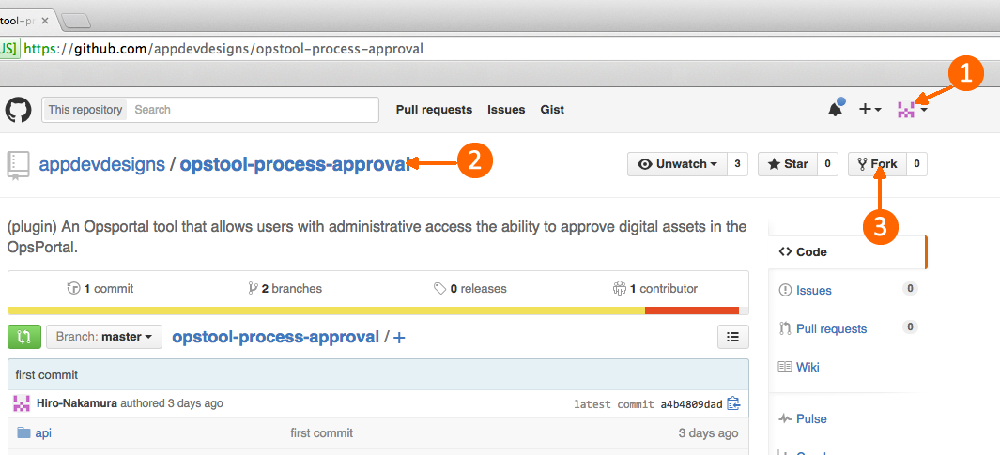
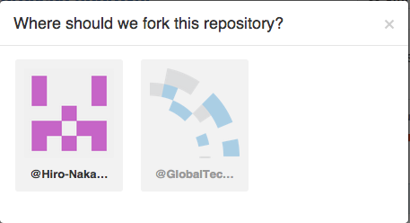
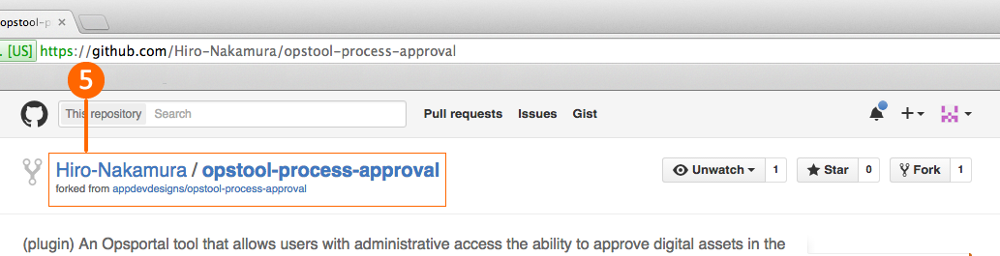
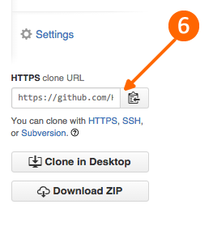

[< Develop](Develop.md)
# Contributing: Create your own Fork of the project


### Prerequisits
Any of the OpsTool projects you work on will need to first have a [SailsJS environment and the OpsPortal installed](develop_setup.md) on your local development machine.  Be sure to do that before you continue on.


### Create your own fork of a project.

1. Log into GitHub under your account:
2. Visit the GitHub repository you want to work on
3. Click [Fork]

4. if you are part of multiple organizations then choose which one (probably personal)

5. You will be taken to YOUR copy of the project

6. Get the URL to your copy

7. now Git clone into your OpsPortal directory:
```sh
# from your Sails directory
$ cd node_modules
$ git clone https://your/git/url/[project].git 
$ cd [project]
$ git checkout -b develop
$ git pull origin develop

```

### Now you're ready to get to work!

  

[< Develop](Develop.md)     
Next: [Keep your Fork up to date >] (develop_contribute_sync.md) 