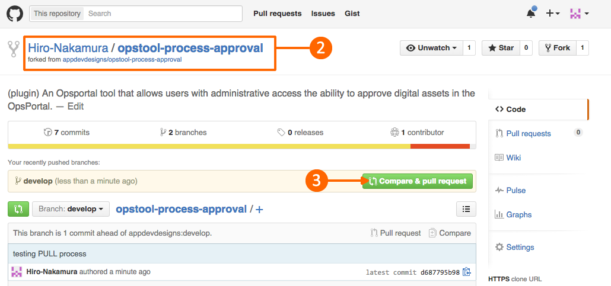
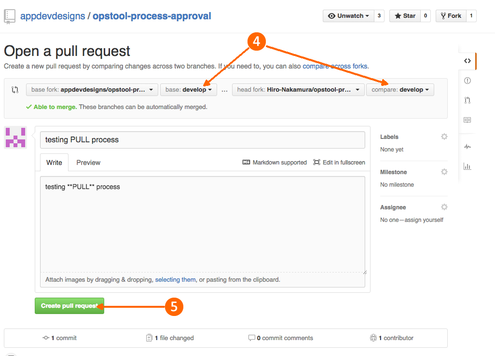

[< Develop](Develop.md)
# Contributing: Submitting PULL requests

When you are finally ready to submit your work back to our project, make a PULL request.


### Setup Our Project as an upstream repository (Only Once)
Now that you have your own copy of the project in your development directory, you need to link it back to the AppDev project.

##### 1. submit a push from your local repository
```sh
$ git add .
$ git commit -m 'very informative comment here'
$ git push origin develop
```

##### 2. Go to **YOUR** GitHub project page 
##### 3. click on the Compare & pull request button


##### 4. Make sure the resulting PULL is against our **#develop** branch
##### 5. Fill out the form and **commit**



### That's it.
Now enjoy your weekend!

  

[< Develop](Develop.md)     
Next: [Submit Pull requests >](develop_contribute_pull.md ) to our #develop branch