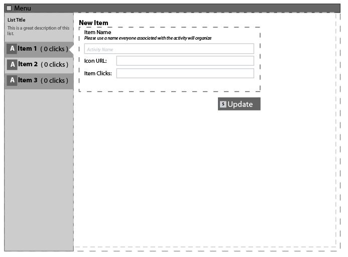

[< Develop](Develop.md)
# Views and HTML Animation

In most MVC approaches to client side development, the HTML views of an application are split out into seperate files and seperatly accessed when filling out with data from a Model and inserted back into the DOM using a Controller.

We've moved away from splitting our Views into seperate files (at least during development) and leaving our HTML as one large template, and having our Controller Animate the single HTML template.

You can read why [here](develop_process_views_why.md).

### The Goal of our approach

1. have a common reference document between our UI Designer and our UI Programmers: `mockup.html`
2. reduce the effort in incorporating changes in the UI design into our MVC architecture.

### So here is an example of how we would do work with Controllers & Views:
For this example, lets suppose we are building a simple application with a list on the left, and a detail section on the right:

1. [Have your UI developer design a mockup](develop_view_ex_01_mockup.md)
2. [plan your UI Controllers](develop_view_ex_02_planControllers.md)
3. [Attach your Program Controller](develop_view_ex_03_programController.md)
4. [Understand the Program Controller](develop_view_ex_04_understandProgramController.md)
5. [Add the List Controller](develop_view_ex_05_listController.md)
6. [Some Final Reminders](develop_view_ex_06_finalReminders.md)

[< Develop](Develop.md)     
Next: [Have your UI developer design a mockup >](develop_view_ex_01_mockup.md)