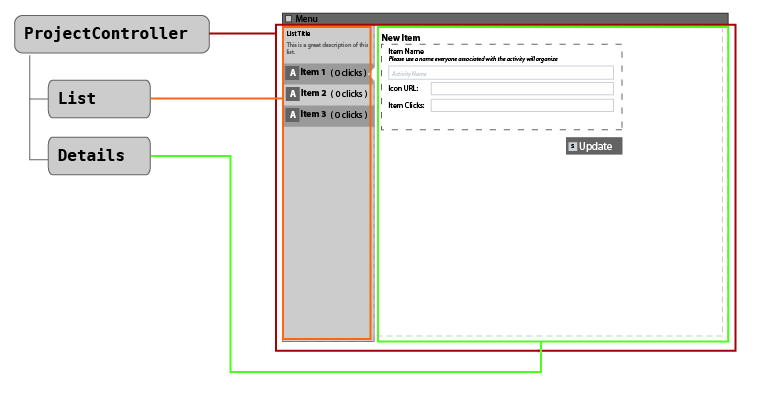

[< Views and HTML Animation](develop_process_views.md)  
# Views and HTML Animation : Plan Your Controllers.

When ever you create an OpsTool, there is a default Controller created that is named after your tool. 
> `[project]/assets/opstools/[ToolName]/controllers/[ToolName].js`

This is the Main controller for the Tool, and it's job is to attach and coordinate any of the Tool's sub controllers.

After looking at the mockup file, we decide there are two additional controllers we need to make:  List and Detail


###### create the controllers:
```sh
# from [project] directory
$ appdev controllerUI opstools/ExampleTool List
$ appdev controllerUI opstools/ExampleTool Detail
```

When this completes you should now have:

+ `[project]/assets/opstools/ExampleTool/controllers/List.js`
+ `[project]/assets/opstools/ExampleTool/controllers/Details.js`


[< Views and HTML Animation](develop_process_views.md)     
Next: [Attach your Program Controller >](develop_view_ex_03_programController.md)