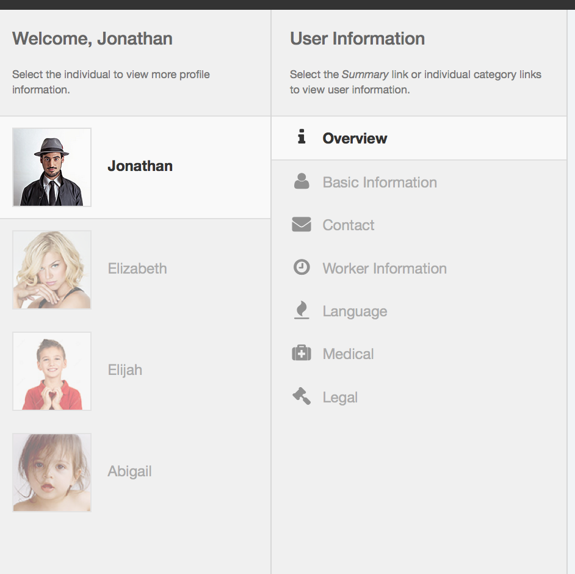
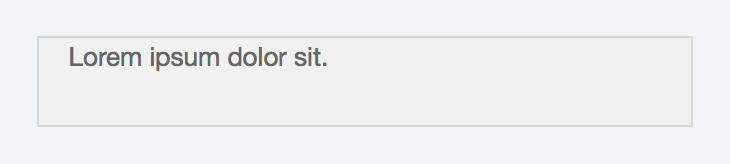
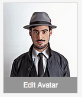

[ < To Readme.md](../README.md)

#AppDevDesigns Style Guide
Readable and portable style guide providing standards for maintaining a consistant look and feel across the different _AppDevDesigns_ tools.

##Table of Contents
* [About] (#about)
 * [About AppDevDesigns] (#about-appdevdesigns)
 * [Design Goals] (#design-goals)
* [Global Styles] (#global-styles)
 * [Bootstrap Overrides] (#bootstrap-overrides)
 * [Global Defaults] (#global-defaults)
 * [Color Themes] (#color-themes)
* [Global Content] (#global-content)
 * [Global Framework] (#global-framework)
 * [Generic Content Blocks] (#generic-content-blocks)
 * [Masthead] (#masthead)
 * [Global Menu] (#global-menu)
 * [Widgets] (#widgets)
 * [Stage] (#stage)
* [Specialized Content] (#specialized-content)
 * [Icons] (#icons)
 * [Avatars] (#avatars)
 * [Modal Windows] (#modal-windows)
 * [Tooltips] (#tooltips)
 * [Dropzone] (#dropzone)
* [HTML Blocks] (#html-blocks)
 * [Lists] (#lists)
 * [Tables] (#tables)
 * [Margins] (#margins)
 * [Buttons] (#buttons)

##About 
###About AppDevDesigns 
This is a wonderful description of AppDevDesigns!
 
---

###Design Goals 
This is where we provide general design goals for AppDevDesigns tools!

---

##Global Styles 
###Bootstrap Overrides 
The Bootstrap Framework provides the CSS foundation on which tools are built. The bootstrap file, located in "/assets/js/bootstrap/css/", should never be edited. All CSS that overrides Bootstrap should be placed in section 0 in "opsportal.css", located in "/node_modules/appdev-opsportal/assets/OpsPortal/".

---
 
###Global Defaults 
Default CSS applied to all tools should be placed in section 1 in "opsportal.css", located in "/node_modules/appdev-opsportal/assets/OpsPortal/".

When there are no custom defaults defined in "opsportal.css", Bootstrap style definitions are used as the default.

---

###Color Themes 
Default colors applied to all tools should be placed in "opsportal-theme.css", located in "/node_modules/appdev-opsportal/assets/OpsPortal/". Custom themes can be created in files that follow the standard naming structure of "opsportal-theme-themename.css" where _themename_ is the custom name of the theme. 

---

##Global Content 
###Global framework 
Appdevdesign tools are visually broken out into three primary sections (see screenshot below):

1. Masthead - contains the "Menu" link and contextual navigation
2. Stage - further broken into two sections: _tool widgets_ and _main content_ area
3. Sidebar Menu - hidden by default, contains list of globally available tools

The html for the global framework is found in "/node_modules/appdev-opsportal/assets/OpsPortal/views/OpsPortal/OpsPortal.ejs"

	

	    <!-- Masthead -->
		

			<!-- masthead-specific code removed for brevity sake -->
        	
		<!-- Global menu (Widget hidden by default) -->
		

	
		<!-- Stage -->
		

    
	

###Masthead 
The masthead is the global bar at the top of every tool, as seen in the screenshot below. The html for the masthead is found in "/node_modules/appdev-opsportal/assets/OpsPortal/views/OpsPortal/OpsPortal.ejs".

The default html for the masthead is below, with inline comments.

	

        
		<!-- This Menu link activates the hidden sidebar menu -->
		

			<a href="#sidr-main"><i class="fa fa-bars"></i> Menu 16</a>
		

		
		<!-- The following code is optional, and is inserted when a specific tool has contextual navigation specific to the tool -->
		

			<ul class="list-unstyled list-inline" area="[[= area.key ]]">
				<li class="active"><a href="#" class="" role="button" obj-embed="tool">[[= tool.label ]]</a></li>
				<li><a href="#" class="" role="button" obj-embed="tool">Sublink 2</a></li>
				<li><a href="#" class="" role="button" obj-embed="tool">Sublink 3</a></li>
			</ul>
		

    

---

###Global Menu 
The global menu is hidden by default, and contains a list of globally available tools (limited by user permissions). See screenshot below:

The containing html is found in "/node_modules/appdev-opsportal/assets/OpsPortal/views/OpsPortal/OpsPortal.ejs".

	

The html for the list of tools is found in "/node_modules/appdev-opsportal/assets/OpsPortal/views/MenuList/" in "MenuList.ejs" and "MenuItem.ejs".

####MenuList.ejs

	

		

			<ul class="op-list" id="op-list-menu">
			</ul>
		

		

			
		

	

####MenuItem.ejs

	<li class="op-container" area="<%= area.key %>">
		<% if (area.key != 'profile'){ %>8<% } %>
		<i class="fa fa-fw op-icon-fw <%= area.icon %>"></i><%= area.label %>
	</li>
	

---

###Widgets 
Widgets are horizontally stacked along the left side of the stage. They take up the full height of the browser window, and have an internal scrollbar when the content extends vertically beyond the height of the browser window. They are contained in the following html with three primary sections:

1. Masthead
2. Body
3. Footer
	
	<!-- The id is specific to the widget name -->
	

	
		

			<h3>Widget masthead header</h3>
			
Lorem ipsum dolor sit.

		

		

			<!-- Widget body content goes here -->
		

		
		

			<!-- Widget footer content goes here -->
		

	

See the following screenshot for an example of a _widget_.

---

###Stage 
The main content area is contained in the following html with two primary sections:

1. Masthead
2. Body

	<!-- The id is specific to the type of content to display on stage -->
	

		

			<h2>Stage masthead header</h2>
		

		

			<!-- Main content here -->
		

	

---

###Generic Content Blocks 
Content is placed inside of generic content blocks with a css class of `class="op-container"`. The content blocks can be block level elements including, but not limited to, _div_, _p_, _ol_, _ul_, _li_. See example below.

	

		
Lorem ipsum dolor sit.

	

Content can also be given further visual context by applying the classes `class="op-block"` and `class="op-block-border"`. This sets the content apart from surrounding content by applying default _margin_, _padding_, and _border_ styles. See example code and screenshot below.

	

		
Lorem ipsum dolor sit.

	

Content blocks can also leverage Bootstrap _row_ and _column_ styles for layout. See example below.

	

		

			
Lorem ipsum dolor sit.

		

	

---

##Specialized Content 
###Font Icons 
Font Icons are small fonts/graphics associated with specific content. AppDevDesigns primarily uses [FontAwesome](http://fortawesome.github.io/Font-Awesome/) to render icons. The following code is the default html/css used to render icons. Note: the following example is rendering the multiplication symbol...visit [here](http://fortawesome.github.io/Font-Awesome/icons/) to view all FontAwesome icons.

	<i class="fa fa-times"></i>

The following classes can be used to provide additional styling. Note: see opsportal.css, section _=OpsPortal Icons_ for additional icon styles

- fa-fw - fixed width icon
- op-icon-fw - set margin and font size for fixed width icon
- op-icon-hidden-right - icon floated right and opacity set to 0

*NOTE: The CSS applied to icons needs to be reworked!

---

###Avatars 
Avatars are rendered using the following html:

	<!-- thumbnail avatar -->
	
	<!-- large avatar -->
	

To create an editable avatar, wrap the avatar in the following code.

	
<a href="#edit-avatar" title="Edit Avatar">Edit Avatar</a>

See screenshot below for example of editable avatar.

---

###Modal Windows 
Modal windows are created by creating the following link:

	<a href="#id-of-modal-content" data-toggle="modal">Link Text</a>

And creating the following html to contain the modal content:

	

		

		

			

				<button type="button" class="close" data-dismiss="modal" aria-hidden="true">&times;</button>
				<h4 class="modal-title" id="myModalLabel">Edit Personal Information</h4>
			

			

				<!-- content of the modal window -->
			

			

				<button type="button" class="btn op-btn op-btn-dk" data-dismiss="modal">Cancel</button>
				<button type="button" class="btn btn-primary pull-right op-btn">Save</button>
			

		
<!-- /.modal-content -->
		
<!-- /.modal-dialog -->
	
<!-- /.modal -->

See screenshot below for example of a modal window.

---

###Tooltips 
Tooltips are added to elements (links, div, etc) by adding `class="tt"` and `title="the tooltip content"`. Add the attribute `data-placement="left"` (using _left_, _right_, _top_, or _bottom_ for the attribute value) to specific the location of the tooltip. See example below.

	<a href="#" class="tt" title="Tooltip content" data-placement="left">Link</a>

---

###Dropzone 
Dropzone provides drag 'n drop file uploads and utilizes the dropzone.js script. Dropzone uses the following html form:

	<form action="#" class="dropzone op-dropzone" id="">
		
Drop files here or click to upload.
			Want to provide extra notes or instructions? Do it here.
		

	</form>

Dropzones use the the "op-dropzone" class, found in the global opsportal.css file, to style the dropzone. The "op-dropzone" class can be overridden for customized, context-specific styles. See screenshot below for an example of the default dropzone implementation.

---

##HTML Blocks 
###Lists 
Basic non-bulleted lists are constructed using the following html:

	<ul class="op-list">
		<li>List item 1</li>
		<li>List item 2</li>
		<li>List item 3</li>
	</ul>

Widget lists are wrapped in the following html:

	

		

			<h3>Header</h3>
		

	
		

			<ul class="op-list">
				<li class="op-container active">List Item 1</li>
				<li class="op-container">List Item 2</li>
			</ul>
		

	
		

Note
- the class _active_ is added to the current/active list item.

---

###Tables 
Tables are built using the following html:

	<table class="table op-table">
		<tbody>
			<tr>
				<td class="hris-profile-attr">Status</td>
				<td><strong>Awaiting Approval</strong></td>
			</tr>
		</tbody>
	</table>

See _opsportal.css_ section _=OpsPortal Tables_ for additional table styles. See screenshot below for basic rendering of a table in a tool.

Note:
- additional table styles are found in tool-specific stylesheets. Example: _hrisUserProfile.css_

---

###Margins 
Some default margin classes are provided as follows. See _opsportal.css_.

	.op-nopadding { padding: 0 !important; }
	.op-margin-top { margin-top: 15px !important; }
	.op-margin-top-2x { margin-top: 30px !important; }
	.op-margin-bottom { margin-bottom: 15px !important; }
	.op-margin-bottom-2x { margin-bottom: 30px !important; }
	.op-padding-top { padding-top: 15px !important; }
	.op-padding-top-2x { padding-top: 30px !important; }
	.op-padding-bottom { padding-bottom: 15px !important; }
	.op-divider-top { border-top: 1px solid rgba(0, 0, 0, 0.1); padding-top: 15px; }
	.op-divider-bottom { border-bottom: 1px solid rgba(0, 0, 0, 0.1); padding-bottom: 15px; }
	

###Buttons 
Default OpsPortal buttons are implemented on `<a>` and `<button>` tags using the following html:

	<a href="" class="btn op-btn op-btn-dk" role="button">Button Label</a>
	
Note that the "btn" class is found in the default Bootstrap stylesheet, but can be overriden in opsportal.css and opsportal-theme.css. OpsPortal button override styles are found in the following stylesheets:

#####opsportal-theme.css

	.op-btn {
	    margin: 0 5px;
	    opacity: 0.75;
	    transition: opacity 0.3s ease-out 0s;
	}

	.btn, .btn:hover, .btn:focus, a.btn, a.btn:hover, a.btn:visited {
	    border-color: transparent !important;
	    color: #fff;
	}
	
	.op-btn-dk {
	    background-color: #444444;
	    color: #fff;
	}
	
#####opsportal.css

	.btn {
	    white-space: normal !important;
	}
	
See screenshot below for an example of the default button implementation.

#####Button in normal state

#####Button in hover state

####Form Buttons
Buttons used on forms are are laid out left to right, with the "Submit" or "Save" buttons on the right side of the list of buttons. "Submit" or "Save" buttons are blue by default, but can be overriden in opsportal-theme.css. Buttons on forms are implemented using the following html:

	<button type="button" class="btn op-btn op-btn-dk">Cancel</button>
	<button type="button" class="btn btn-primary pull-right op-btn">Save</button>
	
See screenshot below for an example of the default form buttons implementation.

