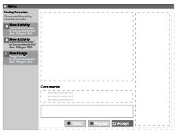

# Tutorial
We've put together a non trivial tutorial of how we built one of our tools.

This tutorial is designed more like a sprint by sprint journal of how the development of the tool progressed, and how we implemented each step of the design.  

### Overview
In this tutorial we are designing an Approval Tool that can be used in the OpsPortal to allow a user with appropriate permissions to approve a transaction/object in the system.  These transactions/objects can come from other OpsPortal tools, and can be just about any set of data you want reviewed by an administrator.  The Approval Tool will report back to the originating tool the results of the approval step.

Take a few minutes to look over the original design document [here](ops-approvalTool.pdf).

### Let's Go

+ [sprint 0](tutorial_sprint0.md) : Getting the project setup
+ [sprint 1](tutorial_sprint1.md) : Server side ...
+ [sprint 2](tutorial_sprint2.md) : Animating the Client Side
+ [sprint 3](tutorial_sprint3.md) : Polishing up the App