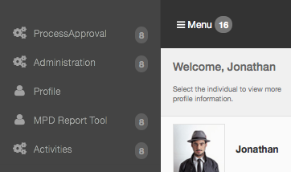
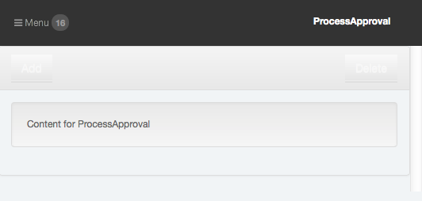

# Sprint 0 : Create a new Plugin
OK, first off we need to physically create the initial OpsPortal plugin for this tool.  The plugin will have two components to it: the server side plugin, and the client side OpsPortal tool.

We have a [tool](../develop/develop_plugin_opstool.md) to help you create both at once.  (Go ahead and read through [what that tool does](../develop/develop_plugin_opstool.md) and what is created before continuing)

In the case of this tutorial, our application is considered part of our `process` management application, and this tool is our `approval` tool.

So to setup this project, I'll run the following command:
```sh
# assuming you are starting in your [sails] directory:
$ cd node_modules/
$ appdev opstoolplugin opstool-process-approval
   # there will be a series of questions about your npm package:
   #    client side unit tests:  for testing out UI
   #    author / description / version : yeah, you can figure those out
   #    git repository:  by default appdevdesigns/[pluginName] <-- you'll wanna change that to yours.
```
>NOTE: by default the git repository is setup to use 'appdevdesigns'.  But you will want to change that git repository to your own.


In order to verify things are at least initially working:
```sh
$ cd opstool-process-approval
$ npm test
```

I see something that looks like:
```sh
> opstool-process-approval@0.0.0 test /path/to/my/sails/node_modules/opstool-process-approval
> make test


  0 passing (1ms)
```

Now lets start up sails and check it in the browser:
```sh
$ cd ../..
$ sails lift
```

And now I see the new `ProcessApproval` Area defined in the OpsPortal Menu:


And a tool with some default HTML that is displayed:



---
[< sprint 0](tutorial_sprint0.md)
[step 2 : Create the Github Project >](tutorial_sprint0_02_createProject.md) 
