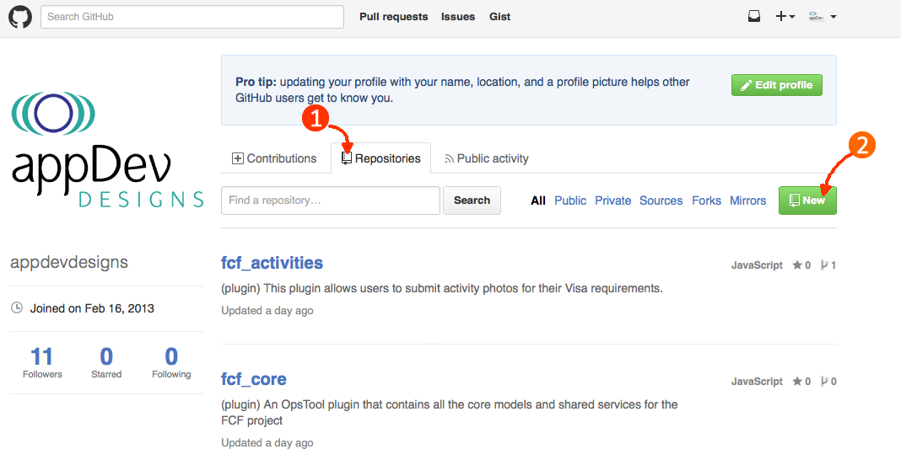
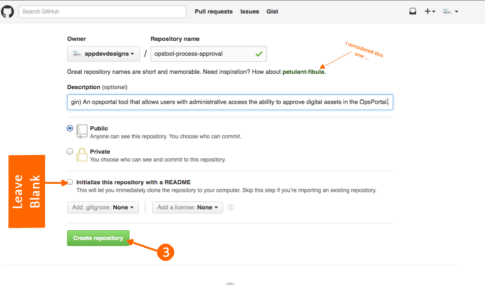

# Sprint 0 : Step 2: Create the Github Project
Now we need to setup our project on Github.

I go to our github page:  https://github.com/appdevdesigns

1. Click on the `Repositories` tab
2. Click on the `New` button
   
3. Fill out the new Repo info: DO NOT INITIALIZE the project
   
4. Now manually initialize and push up the project's `#master` branch:
   ```sh
   # assuming you are in your sails folder:
   $ cd node_modules/opstool-process-approval
   $ git init
   $ git add .
   $ git commit -m "initial commit"
   $ git remote add origin https://github.com/appdevdesigns/opstool-process-approval.git
   $ git push -u origin master
   ```

+ Now create a `#develop` branch for our team:
   ```sh
   $ git checkout -b develop
   $ git push -u origin develop
   ```

Now at this point this project is now hosted on github for our developers to access, and we have our standard `#master` and `#develop` branches.

You can read here about how we implement our [git branching strategy.](http://nvie.com/posts/a-successful-git-branching-model/)


---
[< sprint 0](tutorial_sprint0.md)
[step 3 : Setup Travis CI >](tutorial_sprint0_03_setupTravisCI.md) 
