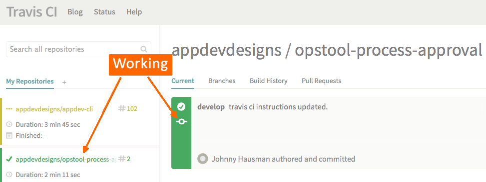

# Sprint 0 : Step 3: Setup Travis CI
In order to know the status of our project, we are using Travis CI to perform our continuous integration testing.  This way we know if any new changes being committed or any new Pull Requests will break any of our tests.

You can read a breakdown of how our plugin's Travis CI config is setup.

To tell Travis CI about our project, I go to: https://travis-ci.org

On the main portal page for our account (appdevdesigns):

+ 1) Click on the [+] icon over your repository list
   
+ 2) Find our new `opsportal-process-approval` entry in our list and switch it 'on'
   
+ initiate another `git push` to trigger a Travis CI build
   ```sh
   # still in plugin directory from last step:
   $ vi Readme.md
       # insert a space at the end
   $ git add .
   $ git commit -m 'test travis ci integration'
   $ git push -u origin develop
   ```

+ Check that Travis CI processes the new submission and everything checks out:
   


OK, at this point our project has an initial code base that is shared on GitHub and monitored with Travis CI.  

Now we are ready to get some developers setup.


---
[< sprint 0](tutorial_sprint0.md)
[step 4 : Outsource our UI design >](tutorial_sprint0_04_outsourceUIDesign.md) 
