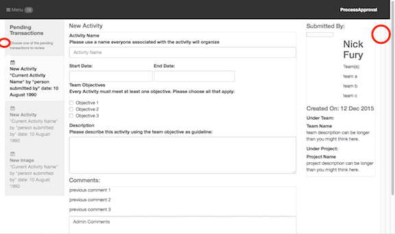

[< Tutorial Sprint 2](tutorial_sprint2.md)
# Tutorial - Copy the UI design to the project template


### Overview
Taking the UI designs and incorporating it into the project.


### Prerequsite
It would be helpful to read through our discussion on [html animation](../develop/develop_process_views.md).


### Let's Go
In our project directory there is an `[plugin]/assets/mockup.html` file that contains our UI designers mockup.  In addition our UI designer will have added any javascript, css or image resources in the appropriate folders in `[plugin]/assets`.


So, open the `mockup.html` file and copy all the contents between the provided `<!-- HTML Mockup Here -->` and `<!-- End HTML Mockup -->` tags.

Now paste this content into your default controller's template file: `[plugin]/assets/opstools/ProcessApproval/views/ProcessApproval/ProcessApproval.ejs`


Next, we need to tell our OpsPortal to include the ProcessApproval tool.  Add a new Area/Tool definition to our `opsportal.js` config file:
```javascript
// [sails]/config/opsportal.js

    //
    // New OpsTool: ProcessApproval
    // 
    {
        // Define the Area for ProcessApproval
        icon:'fa-cogs',
        key:'ProcessApproval',
        label:'ProcessApproval',
        tools:[{

            // ProcessApproval Tool
            controller:'ProcessApproval',
            label:'ProcessApproval',
            isDefault: true,
            permissions:[
                'adcore.admin'
                , 'adcore.developer'
            ]
          }
        ]
    }

```
>NOTE: depending on where you add this, be sure to add the proper `,` to insert it into the json array.

Start sails:
```sh
# in your [sails] directory
$ sails lift
```

Then open the OpsPortal in your web browser: `http://localhost:1337/page/opsportal`

Opening the ProcessApproval tool shows you the following view:


> NOTE: I noticed some visual glitches that I have circled on the image.  I'm going to have the UI designer look into those and fix them.  In the mean time, I'll continue to work on what we have and automate the UI.


Now we are ready to begin attaching controllers and animating the UI.


---
[< Tutorial Sprint 2](tutorial_sprint2.md)
[step 2 : Initial Controller layout and Events >](tutorial_sprint2_02_initialControllers.md) 