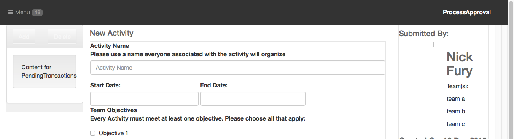

[< Tutorial Sprint 2](tutorial_sprint2.md)
# Tutorial - Initial Controller layout and Events


### Overview
In this step we are going to implement the central Application Controllers.


### Prerequsite
It would be helpful to read through our discussion on [html animation](../develop/develop_process_views.md).


### Let's Go
In our [design document](ops-approvalTool.pdf), we gave a brief discussion of how we expected the UI controller layout to work.


When we first created the plugin, there was a client side application structure created in `[plugin]/assets/opstools/[pluginName]`.  (our `[pluginName]` == `ProcessApproval`).  

By default, our plugin structure will define your initial UI controller in `[plugin]/assets/opstools/[pluginName]/controllers/[pluignName].js`.  
> NOTE: in our design .pdf we called the root controller `ApplicationController` but now that we have made the plugin, it is named `ProcessApproval`.

It is this initial UI controller that is responsible for pulling in any sub controllers and any resources that it needs to operate.  So go ahead and open our `[plugin]/assets/opstools/ProcessApproval/controllers/ProcessApproval.js` file:
```javascript
// [plugin]/assets/opstools/ProcessApproval/controllers/ProcessApproval.js
steal(
        // List your Controller's dependencies here:
        'appdev',
        '//OpsPortal/classes/OpsTool.js',
        '/opstools/ProcessApproval/views/ProcessApproval/ProcessApproval.ejs',
function(){

    // Namespacing conventions:
    // AD.Control.OpsTool.extend('[ToolName]', [{ static },] {instance} );
    AD.Control.OpsTool.extend('ProcessApproval', {

        init: function (element, options) {
            var self = this;
            options = AD.defaults({
                    templateDOM: '//opstools/ProcessApproval/views/ProcessApproval/ProcessApproval.ejs',
                    resize_notification: 'ProcessApproval.resize',
                    tool:null   // the parent opsPortal Tool() object
            }, options);
            this.options = options;

            // Call parent init
            this._super(element, options);

            this.initDOM();
        },


        initDOM: function () {

            this.element.html(can.view(this.options.templateDOM, {} ));

        }

    });

});
```

Here we have a standard [CanJS controller](http://canjs.com/docs/can.Control.html) defined with two methods: `init` and `initDOM`.

+ `init` : is the setup method that initializes all the default option values, calls our `AD.Control` parent constructor, and then calls the `initDOM()` method
+ `initDOM` : currently reads in the template stored in our default template, and inserts that into our default Tool element.


### Create our sub controllers
According to our design, our `ProcessApproval` controller is responsible for two child controllers: `PendingTransactions` and `ApprovalWorkspace`.

Let's go ahead and create those controllers now:
```sh
# in [plugin] directory
$ appdev controllerUI opstools/ProcessApproval PendingTransactions
$ appdev controllerUI opstools/ProcessApproval ApprovalWorkspace
```

You should now have two new controllers : 

+ [plugin]/assets/opstools/ProcessApproval/controllers/PendingTransactions.js
+ [plugin]/assets/opstools/ProcessApproval/controllers/ApprovalWorkspace.js

And each of those controllers have a default `view` created for them:

+ [plugin]/assets/opstools/ProcessApproval/views/PendingTransactions/PendingTransactions.ejs
+ [plugin]/assets/opstools/ProcessApproval/views/ApprovalWorkspace/ApprovalWorkspace.ejs

> NOTE: a controller gets it's own folder in the `/views` directory. 

Now let's tell our `ProcessApproval` controller to include these in our dependencies:
```javascript
// [plugin]/assets/opstools/ProcessApproval/controllers/ProcessApproval.js
steal(
        // List your Controller's dependencies here:
        'appdev',
        '//OpsPortal/classes/OpsTool.js',
        '/opstools/ProcessApproval/controllers/PendingTransactions.js',
        '/opstools/ProcessApproval/controllers/ApprovalWorkspace.js',
        '/opstools/ProcessApproval/views/ProcessApproval/ProcessApproval.ejs',
function(){
```
>NOTE: the path is specified relative to the `[plugin]/assets/` directory.

I'm now going to create a new method to attach those controllers:
```javascript
        initControllers: function() {

            this.controllers = {};  // hold my controller references here.

        },
```

And I want to call this method **AFTER** the `initDOM()` is called:
```javascript
// [plugin]/assets/opstools/ProcessApproval/controllers/ProcessApproval.js

        init: function (element, options) {
            var self = this;
            options = AD.defaults({
                    templateDOM: '//opstools/ProcessApproval/views/ProcessApproval/ProcessApproval.ejs',
                    resize_notification: 'ProcessApproval.resize',
                    tool:null   // the parent opsPortal Tool() object
            }, options);
            this.options = options;

            // Call parent init
            this._super(element, options);

            this.initDOM();
            this.initControllers();		// <----- here
        },
```


OK, let's get a reference to the first controller: `PendingTransactions`.  Open the `[plugin]/assets/opstools/ProcessApproval/controllers/PendingTransactions.js` file and look how the controller is defined:
```javascript
    AD.Control.extend('opstools.ProcessApproval.PendingTransactions', {  
```

The `AD.Control.extend()` method takes a reference `id` as it's first parameter.  It is this `id` that you will need to use to access the controller.  

So now update your `ProcessApproval.initControllers()` method to get access to this controller:
```javascript
// [plugin]/assets/opstools/ProcessApproval/controllers/ProcessApproval.js

        initControllers: function() {

            this.controllers = {};  // hold my controller references here.

            var PendingTransactions = AD.Control.get('opstools.ProcessApproval.PendingTransactions');

        },
```

Now that we have the controller's `Constructor`, we can attach it to the DOM.  

Let's figure out what DOM element we need to attach it to.  Take a look at the HTML provided by our UI designer:
```html
<!-- [plugin]/assets/opstools/ProcessApproval/views/ProcessApproval/ProcessApproval.ejs  -->

<!-- Widget -->  

<div class='col-xs-2 op-container hris-user-widget'>
    <!--Left bar-->
    <div  class="op-container op-widget sticky" id="left-menu">
        
    	<!-- list details removed for brevity -->

    </div>
    <!--/Left bar-->
    
</div>

<!-- Main stage area -->
<div class='col-xs-10 op-container op-stage'>

	<!-- work area details removed for brevity -->

</div>

```

It looks like the `div#left-menu` is the element that is our list.  However, because this is an OpsTool that might sit on the OpsPortal with numerous other tools, I don't like referencing things with id's.  It is bad practice to have several elements with the same id on the page, so let's remove the id from this element and create a unique class to reference this element:
```html
<!-- [plugin]/assets/opstools/ProcessApproval/views/ProcessApproval/ProcessApproval.ejs  -->

<!-- Widget -->  

<div class='col-xs-2 op-container hris-user-widget'>
    <!--Left bar-->
    <div  class="op-container op-widget sticky pa-pendingtransactions" >
        
    	<!-- list details removed for brevity -->

    </div>
    <!--/Left bar-->
    
</div>

<!-- Main stage area -->
<div class='col-xs-10 op-container op-stage'>

	<!-- work area details removed for brevity -->

</div>

```

>Note: when creating unique classes I usually namespace them using a [plugin]-[section]-[widget] format.  However, this tool has a simple layout, so I'll just use `[plugin]-[widget]` as my format.  
> `[plugin]` = `pa` (for ProcessApproval)
> `[widget]` = `pendingtransactions`  (the same as my controller name)

Now let's attach our PendingTransactions controller:
```javascript
// [plugin]/assets/opstools/ProcessApproval/controllers/ProcessApproval.js

        initControllers: function() {

            this.controllers = {};  // hold my controller references here.

            var PendingTransactions = AD.Control.get('opstools.ProcessApproval.PendingTransactions');
            this.controllers.PendingTransactions = new PendingTransactions(this.element.find('.pa-pendingtransactions'), {});
        },
```

Reload the OpsPortal and see what happens to the page:


+ The Good News:  the controller is attached and updating it's DOM element with a default template
+ The Bad News:  we don't want that template overwriting the default DOM.

So, open the `PendingTransactions` controller and edit the `initDOM` method to not overwrite it's contents:
```javascript
// [plugin]/assets/opstools/ProcessApproval/controllers/PendingTransactions.js
        initDOM: function () {

            // this.element.html(can.view(this.options.templateDOM, {} ));

        },
```

Reloading the page now, will display the original DOM as we intended.

We now repeat this process for the `ApprovalWorkspace` controller.  

Our `initControllers()` method:
```javascript
// [plugin]/assets/opstools/ProcessApproval/controllers/ProcessApproval.js

        initControllers: function() {

            this.controllers = {};  // hold my controller references here.

            var PendingTransactions = AD.Control.get('opstools.ProcessApproval.PendingTransactions');
            this.controllers.PendingTransactions = new PendingTransactions(this.element.find('.pa-pendingtransactions'), {});
        
            var ApprovalWorkspace = AD.Control.get('opstools.ProcessApproval.ApprovalWorkspace');
            this.controllers.ApprovalWorkspace = new ApprovalWorkspace(this.element.find('.pa-approvalworkspace'), {});
        },
```

Our `ProcessApproval.ejs`:
```html
<!-- [plugin]/assets/opstools/ProcessApproval/views/ProcessApproval/ProcessApproval.ejs  -->

<!-- Widget -->  

<div class='col-xs-2 op-container hris-user-widget'>
    <!--Left bar-->
    <div  class="op-container op-widget sticky pa-pendingtransactions" >
        
    	<!-- list details removed for brevity -->

    </div>
    <!--/Left bar-->
    
</div>

<!-- Main stage area -->
<div class='col-xs-10 op-container op-stage  pa-approvalworkspace'>

	<!-- work area details removed for brevity -->

</div>

```

And our `ApprovalWorkspace.initDOM()` method:
```javascript
// [plugin]/assets/opstools/ProcessApproval/controllers/ApprovalWorkspace.js
        initDOM: function () {

            // this.element.html(can.view(this.options.templateDOM, {} ));

        },
```


### Communication between widgets
In our application, we need to coordinate how the application passes information between one widget and another.  In this case, when an item is selected in our `PendingTransactions` list, how does the `ApprovalWorkspace` hear about it?

We have numerous options:

+ [CanJS Routes](http://canjs.com/docs/can.route.html) 
+ Pub/Sub Messaging 
+ [jQuery Event Emmiting](https://api.jquery.com/category/events/event-handler-attachment/)

This application layout is simple enough, our tutorial will use the jQuery Event Emitter approach.


> Design Rule:
> A parent controller coordinates the communicate between it's sub controllers.

In our application our parent `ProcessApproval` controller will need to listen for the `PendingTransaction` controller to indicate an item in it's list was selected, and then pass that information to the `ApprovalWorkspace` controller.

Let's start by creating a new `ITEM_SELECTED` constant in our `ProcessApproval` controller:
```javascript
// [plugin]/assets/opstools/ProcessApproval/controllers/ProcessApproval.js
    // Namespacing conventions:
    // AD.Control.OpsTool.extend('[ToolName]', [{ static },] {instance} );
    AD.Control.OpsTool.extend('ProcessApproval', {

        CONST: {
            ITEM_SELECTED   : 'Transaction.Selected'
        }, 
```

We will tell our `PendingTransactions` controller to use this as the event for when an item is selected:
```javascript
// [plugin]/assets/opstools/ProcessApproval/controllers/ProcessApproval.js
        initControllers: function() {

            this.controllers = {};  // hold my controller references here.

            var PendingTransactions = AD.Control.get('opstools.ProcessApproval.PendingTransactions');
            this.controllers.PendingTransactions = new PendingTransactions(this.element.find('.pa-pendingtransactions'), { eventItemSelected: this.CONST.ITEM_SELECTED });
        
```


Create a new `initEvents()` method to now listen for this event:
```javascript
// [plugin]/assets/opstools/ProcessApproval/controllers/ProcessApproval.js
        initEvents: function () {

            var _this = this;

            // event: ItemSelected 
            // when an item is selected in our PendingTransactions list, pass 
            // that item on to the ApprovalWorkspace Controller
            // @param: {obj} transaction  The transaction that was selected
            this.controllers.PendingTransactions.element.on(this.CONST.ITEM_SELECTED, function(event, transaction) {

            	// pass the transaction off to the ApprovalWorkspace
            	_this.controllers.ApprovalWorkspace.setTransaction(transaction);

            });
        },
        
```


Make sure this method is called **AFTER** our `initControllers()` :
```javascript
// [plugin]/assets/opstools/ProcessApproval/controllers/ProcessApproval.js
        init: function (element, options) {
            var self = this;
            options = AD.defaults({
                    templateDOM: '//opstools/ProcessApproval/views/ProcessApproval/ProcessApproval.ejs',
                    resize_notification: 'ProcessApproval.resize',
                    tool:null   // the parent opsPortal Tool() object
            }, options);
            this.options = options;

            // Call parent init
            this._super(element, options);

            this.initDOM();
            this.initControllers();
            this.initEvents();			// <-- Here
        },
        
```


Make sure our `ApprovalWorkspace` has a `.setTransaction()` method:
```javascript
// [plugin]/assets/opstools/ProcessApproval/controllers/ApprovalWorkspace.js
        setTransaction: function ( transaction ) {

            console.warn('*** ApprovalTransaction: received a transaction:', transaction);
        },
        
```

At this point, our information exchange is setup.  Now we need our `PendingTransactions` controller to actually function like a list.


>NOTE: go ahead and copy your changes from your `[plugin]/assets/opstools/ProcessApproval/views/ProcessApproval/ProcessApproval.ejs` back into the `[plugin]/assets/mockup.html` so your UI designer will have your latest changes to work with.


---
[< step 1: Copy the UI design to the project template](tutorial_sprint2_01_copyDesign.md)
[step 3 : PendingTransactions List >](tutorial_sprint2_03_pendingTransactions.md) 
