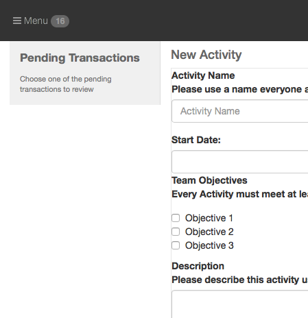
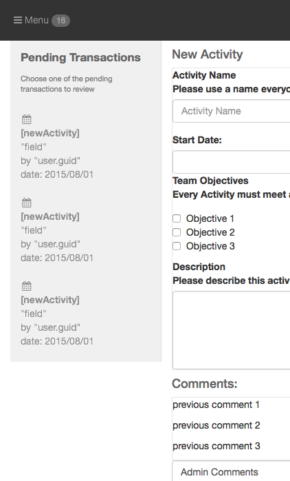
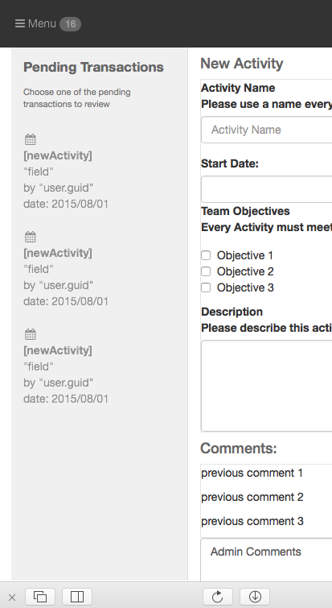
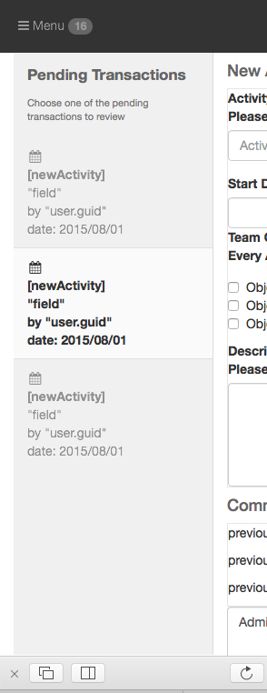

[< Tutorial Sprint 2](tutorial_sprint2.md)
# Tutorial - PendingTransactions list


### Overview
Animate the PendingTransaction List widget.


### Getting our Data
Back in [Sprint 1](tutorial_sprint1_01_models.md) we created our models `PARequest` and `PAComment`.  When we used the `appdev resource` command, it also created some client side models to connect with those model's RESTful api.

You should also have two client side models:

+ `[plugin]/assets/opstools/ProcessApproval/models/PARequest.js`
+ `[plugin]/assets/opstools/ProcessApproval/models/PAComment.js`

Look at your `PARequest` model definition:
```javascript
// [plugin]/assets/opstools/ProcessApproval/models/PARequest.js
steal(
        'appdev',
        'opstools/ProcessApproval/models/base/PARequest.js'
).then( function(){

    // Namespacing conventions:
    // AD.Model.extend('[application].[Model]', {static}, {instance} );  --> Object
    AD.Model.extend('opstools.ProcessApproval.PARequest', {
/*
        findAll: 'GET /opstool-process-approval/parequest',
        findOne: 'GET /opstool-process-approval/parequest/{id}',
        create:  'POST /opstool-process-approval/parequest',
        update:  'PUT /opstool-process-approval/parequest/{id}',
        destroy: 'DELETE /opstool-process-approval/parequest/{id}',
        describe: function() {},   // returns an object describing the Model definition
        fieldId: 'id',             // which field is the ID
        fieldLabel:'actionKey'      // which field is considered the Label
*/
    },{
/*
        // Already Defined:
        model: function() {},   // returns the Model Class for an instance
        getID: function() {},   // returns the unique ID of this row
        getLabel: function() {} // returns the defined label value
*/
    });


});
```

The `AD.Model.extend()` method takes a model's reference id as the first parameter.  We'll need to use that reference id when getting access to the model in our `PendingTransaction` List controller.

Let's now update the `PendingTransactions` Controller to request a list of all the transactions this user is allowed to see.

First, make sure our `PendingTransactions` Controller list our `PARequest` Model as a dependency:
```javascript
// [plugin]/assets/opstools/ProcessApproval/controllers/PendingTransactions.js
steal(
        // List your Controller's dependencies here:
        'appdev',
        'opstools/ProcessApproval/models/PARequest.js',
function(){
```

Now get the Model object and `.findAll()` the transactions we are allowed to see:
> NOTE: in sprint 1 we already did all the modifications to the `find` api that limits the response back.

```javascript
// [plugin]/assets/opstools/ProcessApproval/controllers/PendingTransactions.js

  init: function (element, options) {
      var self = this;
      options = AD.defaults({
              // templateDOM: '//opstools/ProcessApproval/views/PendingTransactions/PendingTransactions.ejs'
      }, options);
      this.options = options;

      // Call parent init
      this._super(element, options);


      this.initDOM();


      // now load our data from the server:
      this.PARequest = AD.Model.get('opstools.ProcessApproval.PARequest');
      this.PARequest.findAll()
      .fail(function(err){
          console.error("!!! Dang.  something went wrong:", err);
      })
      .then(function(list){
          console.log("... here is our list of pending transactions:", list);
      });

  },
```

Now if you reload the OpsPortal and watch the console you should see the list of transactions returned from the server.

> Troubleshooting Tips:
> If you are getting an empty [] returned for your data, then most likely the user account you are accessing the site with (`admin` ?) has not been granted permission to either:
> 1) have access to the `actionKey` that is listed in our PARequests
> 2) have a scope defined that allows the `userID` associated with the `actionKey` in 1)
>
>In my case, I did get an empty `[]` returned and discovered that my fixture data we created [way back when](tutorial_sprint0_05_designFixtures.md) was using a `tool.action.key.1` actionKey value, which is not available in the system to allow myself access to.  So, I updated my fixture data to use `process.approval.tool.view` for all the actionKeys instead.
>
>I then cleared out my mysql table.  I restarted sails.  And in a few seconds, our develop script that inserts new values into the table repopulated the table with the new values.
>
>Now when I reload the OpsPortal, I see values returned in my response.


### Displaying our data
In order to display the data, we need to transform the HTML mockup we are working with, into a template.

Here is the HTML for the list:
```html
<!--Left bar-->
<div  class="op-container op-widget sticky pa-pendingtransactions" >
    <div class="op-widget-masthead">
        <h3><strong>Pending Transactions</strong></h3>
        <p>Choose one of the pending transactions to review</p>
    </div>        
    <div class="op-widget-body">
      <ul class="op-list">
          
          <li mockup-show="new-activity" class="op-container active">
            <span class="icon"><i class="fa fa-calendar fa-fw"></i></span>
            <div><strong>New Activity</strong><br>
                      "Current Activity Name"<br>
                      by "person submitted by"<br>
                      date: 10 August 1990
            </div>
          </li>
          <li mockup-show="new-activity" class="op-container">
            <span class="icon"><i class="fa fa-calendar fa-fw"></i></span>
            <div><strong>New Activity</strong><br>
                      "Current Activity Name"<br>
                      by "person submitted by"<br>
                      date: 10 August 1990
            </div>
          </li>
          <li mockup-show="new-image" class="op-container">
            <span class="icon"><i class="fa fa-calendar fa-fw"></i></span>
            <div><strong>New Image</strong><br>
                      "Current Activity Name"<br>
                      by "person submitted by"<br>
                      date: 10 August 1990
            </div>
          </li>
      </ul>
    </div>

    <!--<div class="op-widget-footer">
        <a class="op-toggle" href="#" title="appDev Designs"></a>
    </div> -->
</div>
<!--/Left bar-->
```

This follows the basic format of a list as defined in our [style guide](../style_guide/StyleGuide.md).

+ there is a < masthead >   (list header with title and description)
+ there is a < body >       (list contents )
+ there is a < footer >     (optional and commented out in this section)

The place the actual list is displayed is the `ul.op-list` element.

Following the method mentioned in our [developer guide](develop_view_ex_05_listController_ejs.md) I'll transform this list into a template:

+ I mark all the `li` entries I don't want to use with a class `.mockup`
> NOTE: I chose a `li` that wasn't marked with class `.active`
```html
<ul class="op-list">                  
  <li mockup-show="new-activity" class="op-container active mockup">
    <span class="icon"><i class="fa fa-calendar fa-fw"></i></span>
    <div><strong>New Activity</strong><br>
              "Current Activity Name"<br>
              by "person submitted by"<br>
              date: 10 August 1990
    </div>
  </li>
  <li mockup-show="new-activity" class="op-container">
    <span class="icon"><i class="fa fa-calendar fa-fw"></i></span>
    <div><strong>New Activity</strong><br>
              "Current Activity Name"<br>
              by "person submitted by"<br>
              date: 10 August 1990
    </div>
  </li>
  <li mockup-show="new-image" class="op-container mockup">
    <span class="icon"><i class="fa fa-calendar fa-fw"></i></span>
    <div><strong>New Image</strong><br>
              "Current Activity Name"<br>
              by "person submitted by"<br>
              date: 10 August 1990
    </div>
  </li>
</ul>
```
+ Now I transform the `li` I wanted into an ejs template:
```html
<% var menuData = item.objectData.objectData.menu; %>
<li mockup-show="new-activity" class="op-container">
	<span class="icon"><i class="fa <%= menuData.icon %> fa-fw"></i></span>
	<div><strong><%= menuData.action.key %></strong><br>
	          "<%= menuData.instanceRef %>"<br>
	          by "<%= menuData.createdBy %>"<br>
	          date: <%= menuData.date %>
	</div>
</li>
```

+ Now take into account I am sending in a list of approvals and display them all:
```html
<% 
items.forEach(function(item) { 
	var menuData = item.objectData.objectData.menu; 
%>
	<li mockup-show="new-activity" class="op-container">
		<span class="icon"><i class="fa <%= menuData.icon %> fa-fw"></i></span>
		<div><strong><%= menuData.action.key %></strong><br>
		          "<%= menuData.instanceRef %>"<br>
		          by "<%= menuData.createdBy %>"<br>
		          date: <%= menuData.date %>
		</div>
	</li>
<%
});
%>
```

+ I'll also embed the individual model instance into the `li` item so I can retrieve it easily later:
```html
<% 
items.forEach(function(item) { 
	var menuData = item.objectData.objectData.menu; %>
	<li mockup-show="new-activity" class="op-container" <%= (el) -> el.data( 'item', item ) %> >
		<span class="icon"><i class="fa <%= menuData.icon %> fa-fw"></i></span>
		<div><strong><%= menuData.action.key %></strong><br>
		        "<%= menuData.instanceRef %>"<br>
		        by "<%= menuData.createdBy %>"<br>
		        date: <%= menuData.date %>
		</div>
	</li>
<%
});
%>
```

+ now finally, I'll swap out the standard ejs tags with our alternate tags:
```html
<!-- 
items.forEach(function(item) { 
	var menuData = item.objectData.menu; -->
	<li mockup-show="new-activity" class="op-container" obj-embed="item" >
		<span class="icon"><i class="fa [[= menuData.icon ]] fa-fw"></i></span>
		<div><strong>[[= menuData.action.key ]]</strong><br>
		        "[[= menuData.instanceRef ]]"<br>
		        by "[[= menuData.createdBy ]]"<br>
		        date: [[= menuData.date ]]
		</div>
	</li>
<!--
});
-->
```


Now our template is ready.  We need to tell our `PendingTransactions` controller to transform this section of HTML into a template:
```javascript
// [plugin]/assets/opstools/ProcessApproval/controllers/PendingTransactions.js
initDOM: function () {

    // this.element.html(can.view(this.options.templateDOM, {} ));

    // keep a reference to our list area:
    this.dom = {};
    this.dom.list = this.element.find('ul.op-list');

    var template = this.domToTemplate( this.dom.list );
    can.view.ejs('PendingTransactions_List', template);

    // and don't forget to clear the List area:
    this.dom.list.html('');

},
```

If we stop here and reload the page, you should see an empty list for our Pending Transactions:



Now we want to take the data we received from our Model and insert this into our template:
```javascript
// [plugin]/assets/opstools/ProcessApproval/controllers/PendingTransactions.js

this.initDOM();

this.data = {};
this.data.listTransactions = null;

// now load our data from the server:
this.PARequest = AD.Model.get('opstools.ProcessApproval.PARequest');
this.PARequest.findAll()
.fail(function(err){
console.error('!!! Dang.  something went wrong:', err);
})
.then(function(list){
    _this.data.listTransactions = list;
    _this.dom.list.html(can.view('PendingTransactions_List', {items:list}));
});
```

Reload the page again, and you should now see actual items in our list:



### List Operation
Now lets spend some time making the list work more like we expect.

###### List should be the Full Height 
We want our list to take up the full height of the area it is in.  The OpsPortal framework provides an `AD.op.Widget` controller than can manage the vertical sizing of a standard Ops Widget.  Our Pending Transactions List follows that format, so we will attach one of these controllers on our element, and tell it when to resize.

First make sure our `PendingTransactions` controller lists our `AD.op.Widget` as a dependency:
```javascript
// [plugin]/assets/opstools/ProcessApproval/controllers/PendingTransactions.js
steal(
        // List your Controller's dependencies here:
        'appdev',
        'OpsPortal/classes/OpsWidget.js',
        'opstools/ProcessApproval/models/PARequest.js',
function(){
```

Now attach the widget controller to our base element:
```javascript
// [plugin]/assets/opstools/ProcessApproval/controllers/PendingTransactions.js

        initDOM: function () {

            // this.element.html(can.view(this.options.templateDOM, {} ));

            // keep a reference to our list area:
            this.dom = {};
            this.dom.list = this.element.find('ul.op-list');

            var template = this.domToTemplate( this.dom.list );
            can.view.ejs('PendingTransactions_List', template);

            // and don't forget to clear the List area:
            this.dom.list.html('');


            this.dom.ListWidget = new AD.op.Widget(this.element);

        },
```


Create a `.resize()` method on our `PendingTransactions` controller to tell our widget to resize:
```javascript
// [plugin]/assets/opstools/ProcessApproval/controllers/PendingTransactions.js

        resize: function(height) {
            this.dom.ListWidget.resize({height: height});
        },
```

Now when our main `ProcessApproval` controller receives a `.resize()` call, have it tell our `PendingTransactions` controller to resize as well:
```javascript
// [plugin]/assets/opstools/ProcessApproval/controllers/ProcessApproval.js

        resize: function(data) {

            this._super(data);

            this.controllers.PendingTransactions.resize(data.height);
            
        }

```

Save everything, and reload your page.  The list should now streach the full available height of the OpsPortal's work area:



###### Clicking on a list entry should show it as `.active`
Let's update the styling of a list entry to be `.active` when it is selected.

Update our `PendingTransactions` controller to setup an event handler for any of it's `li` sub elements:
```javascript
// [plugin]/assets/opstools/ProcessApproval/controllers/PendingTransactions.js

        'li click': function ($el, ev) {

            ev.preventDefault();
        }
```

When clicked, we want to remove the `.active` class from whatever sub element currently has it:
```javascript
// [plugin]/assets/opstools/ProcessApproval/controllers/PendingTransactions.js
        'li click': function ($el, ev) {

            this.element.find('.active').removeClass('active');
            ev.preventDefault();
        }
```

And then we want to add `.active` to the currently clicked element (`$el`):
```javascript
// [plugin]/assets/opstools/ProcessApproval/controllers/PendingTransactions.js
        'li click': function ($el, ev) {

            this.element.find('.active').removeClass('active');
            $el.addClass('active');
            ev.preventDefault();
        }
```

Now reload the page and you should see the list items being selected properly:



###### Clicking on a list entry should trigger an 'item selected' event:
Once a list item is selected, we need to alert our parent controller (`ProcessApproval` controller) that an item was selected.

When we trigger the event, we want to actually send the model instance that was selected as the item that was selected.  So let's get the model instance data that was embedded in the `li` item:
```javascript
// [plugin]/assets/opstools/ProcessApproval/controllers/PendingTransactions.js
        'li click': function ($el, ev) {

            this.element.find('.active').removeClass('active');
            $el.addClass('active');

            var model = $el.data('item');

            ev.preventDefault();
        }
```

Now when our parent controller (`ProcessApproval`) created this one, it passed in an option value for `eventItemSelected`.  We are going to use that value as our trigger event, and pass back the model we just found:
```javascript
// [plugin]/assets/opstools/ProcessApproval/controllers/PendingTransactions.js
        'li click': function ($el, ev) {

            this.element.find('.active').removeClass('active');
            $el.addClass('active');

            var model = $el.data('item');
            this.element.trigger(this.options.eventItemSelected, model);

            ev.preventDefault();
        }
```

And while we are at it, we should make sure there is a default value for `eventItemSelected` if for some reason we are not provided one in our constructor:
```javascript
// [plugin]/assets/opstools/ProcessApproval/controllers/PendingTransactions.js
        init: function (element, options) {
            var _this = this;
            options = AD.defaults({
                    eventItemSelected : 'hey.got.one'    // <-- here
                    // templateDOM: '//opstools/ProcessApproval/views/PendingTransactions/PendingTransactions.ejs'
            }, options);
            this.options = options;

            // Call parent init
            this._super(element, options);

```


Save everything and reload your OpsPortal.  Clicking on an entry in your list should now show you a console.log() displaying your transaction.  


Now we have our list in basic functioning order.  There are some visual `.css` issues with the items in the list, but I'll pass that back to our UI designer to fix.  We'll come back here again later on when we make additional changes for Multilingual labels and all.  But for now, we are moving on ...

---
[< step 2 : Initial Controller layout and Events](tutorial_sprint2_02_initialControllers.md)
[step 4 : Approval Workspace & Instructions >](tutorial_sprint2_04_approvalWorkspace.md) 