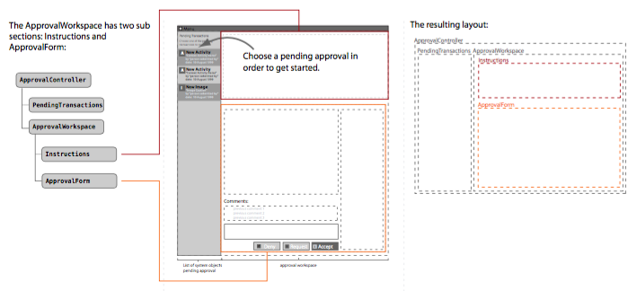

[< Tutorial Sprint 2](tutorial_sprint2.md)
# Tutorial - Approval Workspace & Instructions


### Overview
Now we are going to implement the Approval Workspace controller and it's contents.

According to our initial project design, the `ApprovalWorkspace` is supposed to manage two sub controllers: `Instructions` and `ApprovalForm`.  


However, as I consider what this controller is going to actually be responsible to do ... there isn't much other than being a simple passthrough between the data flowing from the chosen item in the list and the `ApprovalForm`.  So, I'm making the decision to flatten out the design and have the `ApprovalWorkspace` combine the jobs of the `Instructions` and `ApprovalForm`.


### Attach to the Instructions DIV
In our design, there should be a default `Instructions` panel that shows when the tool first loads and nothing is selected.

Our first task is to find that DOM element and make sure that panel is shown when the tool first loads.  Looking at the HTML contained by our `ApprovalWorkspace` controller in `[plugin]/assets/opstools/ProcessApproval/views/ProcessApproval/ProcessApproval.ejs` we see it is laid out like this:
```html
<!-- [plugin]/assets/opstools/ProcessApproval/views/ProcessApproval/ProcessApproval.ejs  -->

<!-- Main stage area -->
<div class='col-xs-10 op-container op-stage pa-approvalworkspace'>

  <!--Form Activity Area-->
  <div id="apprv-activity" class="mockup-display new-activity opsportal-content-area">
         <!-- contents removed for brevity -->               
  </div>

  <!--/Form Activity Area-->
  <!--Image Area-->
  <div id="apprv-image" class="mockup-display new-image opsportal-content-area" style="display:none">
          <!-- contents removed for brevity -->   
  </div>
  <!--/Image Area-->

</div>

```

The UI designer has created two sub forms to represent the two mockup examples of forms we asked him to build.  However, this design **does NOT have** a panel for our instructions.  < sigh >

So, I'm going to add a panel to the HTML, then later I'll have the UI designer go back and actually make it look good.  My additions:
```html
<!-- [plugin]/assets/opstools/ProcessApproval/views/ProcessApproval/ProcessApproval.ejs  -->

<!-- Main stage area -->
<div class='col-xs-10 op-container op-stage pa-approvalworkspace'>

  <!-- Instructions Panel -->
  <div class="mockup-display new-activity opsportal-content-area pa-instructionsPanel">
         <p> Select an entry on the right to begin editing. </p>            
  </div>

  <!--Form Activity Area-->
  <div id="apprv-activity" class="mockup-display new-activity opsportal-content-area">
         <!-- contents removed for brevity -->               
  </div>

  <!--/Form Activity Area-->
  <!--Image Area-->
  <div id="apprv-image" class="mockup-display new-image opsportal-content-area" style="display:none">
          <!-- contents removed for brevity -->   
  </div>
  <!--/Image Area-->

</div>

```

Now have the `ApprovalWorkspace` controller find the `div` and keep a reference for it:
```javascript
// [plugin]/assets/opstools/ProcessApproval/controllers/ApprovalWorkspace.js
        initDOM: function () {

            // this.element.html(can.view(this.options.templateDOM, {} ));
            this.dom = {};
            this.dom.instructions = this.element.find('.pa-approvalworkspace');

        },
```

And make sure that panel is shown when the tool loads:
```javascript
// [plugin]/assets/opstools/ProcessApproval/controllers/ApprovalWorkspace.js
        initDOM: function () {

            // this.element.html(can.view(this.options.templateDOM, {} ));
            this.dom = {};
            this.dom.instructions = this.element.find('.pa-instructionsPanel');


            this.showDOM('instructions');
        },


        showDOM: function( panel ) {

            for(var p in this.dom) {
                if (p == panel) {
                    this.dom[p].show();
                } else {
                    this.dom[p].hide();
                }
            }
        },
```


### Attach to the ApprovalForm
Now we want to pick one of the forms created by our UI designer to be our official `ApprovalForm`.  The other form, we'll mark as a `.mockup` and then remove from the DOM.  (and I also remove the id="..." fields)

Here are my changes to the HTML:
```html
<!-- [plugin]/assets/opstools/ProcessApproval/views/ProcessApproval/ProcessApproval.ejs  -->

<!-- Main stage area -->
<div class='col-xs-10 op-container op-stage pa-approvalworkspace'>

  <!-- Instructions Panel -->
  <div class="mockup-display new-activity opsportal-content-area pa-instructionsPanel">
         <p> Select an entry on the left to begin editing. </p>            
  </div>

  <!--Form Activity Area-->
  <div class="mockup-display new-activity opsportal-content-area pa-approvalForm">
         <!-- contents removed for brevity -->               
  </div>

  <!--/Form Activity Area-->
  <!--Image Area-->
  <div class="mockup-display new-image opsportal-content-area mockup" style="display:none">
          <!-- contents removed for brevity -->   
  </div>
  <!--/Image Area-->

</div>

```

Now remove the unused form:
```javascript
// [plugin]/assets/opstools/ProcessApproval/controllers/ApprovalWorkspace.js
        initDOM: function () {

            // this.element.html(can.view(this.options.templateDOM, {} ));
            this.dom = {};
            this.dom.instructions = this.element.find('.pa-instructionsPanel');

            this.element.find('.mockup').remove();

            this.showDOM('instructions');
        },
```

And attach to the `ApprovalForm`:
```javascript
// [plugin]/assets/opstools/ProcessApproval/controllers/ApprovalWorkspace.js
        initDOM: function () {

            // this.element.html(can.view(this.options.templateDOM, {} ));
            this.dom = {};
            this.dom.instructions = this.element.find('.pa-instructionsPanel');

            this.element.find('.mockup').remove();

            this.dom.approvalForm = this.element.find('.pa-approvalForm');


            this.showDOM('instructions');
        },
```


Now when the `ApprovalWorkspace` is given a transaction to process, make sure the `approvalForm` dom is shown:
```javascript
// [plugin]/assets/opstools/ProcessApproval/controllers/ApprovalWorkspace.js
        setTransaction: function ( transaction ) {

            console.warn('*** ApprovalTransaction: received a transaction:', transaction);
            this.showDOM('approvalForm');
        },
```


Reload the OpsPortal in your browser and you will now see a very unattractive set of instructions in your work area.  Clicking on an entry in your list will now pop up the `ApprovalForm`.


### Converting `ApprovalForm` to a template
The `ApprovalForm` has some data to display that is taken directly from our transaction model. So let's convert it's contents into a template to display.

The current HTML for the `ApprovalForm` looks like this:
```html
<!-- [plugin]/assets/opstools/ProcessApproval/views/ProcessApproval/ProcessApproval.ejs  -->

<!--Form Activity Area-->
<div id="apprv-activity" class="mockup-display new-activity opsportal-content-area pa-approvalForm">
      <div class="op-container">
          <div class="workspace col-lg-9 off-botm20">
              <h4>New Activity</h4> 
              <div class="op-container op-block-border">

                  <!-- Object Template here (and removed for brevity ) -->

              </div>
              <h4>Comments:</h4>
              <div class="op-container op-block-border off-botm10">
                  <p>previous comment 1</p>
                  <p>previous comment 2</p>
                  <p>previous comment 3</p>
              </div>
              <textarea class="form-control" rows="5">Admin Comments</textarea>
              <!--Action Buttons-->
              <div class="op-container op-block nomargintop">
                  <button class="btn btn-success float-right" type="submit">Accept</button>
                  <button class="btn btn-info  float-right offset-15" type="submit">Request</button>
                  <button class="btn btn-warning float-right  offset-15" type="submit"><i class="fa fa-hand-paper-o"></i>Deny</button>
              </div>    
              <!--/Action Buttons-->                
          </div>
          <!--Submitted By Area-->
          <div id="submittedby" class="col-lg-3">
              <div class="op-container op-block-border">
                  
                  <!-- Related Info Template here (and removed for brevity) -->
              </div>       
          </div>
          <!--/Submitted By Area-->    
      </div>    
</div>
<!--/Form Activity Area-->

```

Now I'm going to treat this whole section as a template and pass it our transaction model.

+ display the title (same as on menu)
```html
<!-- [plugin]/assets/opstools/ProcessApproval/views/ProcessApproval/ProcessApproval.ejs  -->
          <div class="workspace col-lg-9 off-botm20">
            <h4>[[= transaction.objectData.menu.key ]]</h4> 
              <div class="op-container op-block-border pa-approvalForm-objTemplate">
```

+ display any embedded comments:
```html
<!-- [plugin]/assets/opstools/ProcessApproval/views/ProcessApproval/ProcessApproval.ejs  -->
                              <h4>Comments:</h4>
                              <div class="op-container op-block-border off-botm10">
                              <!-- transaction.comments.forEach(function(comment){ -->

                                  <p>[[= comment.comment ]]</p>

                              <!-- })  -->
                              </div>
```


+ now just go ahead and make this a template:
```javascript
// [plugin]/assets/opstools/ProcessApproval/controllers/ApprovalWorkspace.js
        initDOM: function () {

            // this.element.html(can.view(this.options.templateDOM, {} ));
            this.dom = {};
            this.dom.instructions = this.element.find('.pa-instructionsPanel');

            this.element.find('.mockup').remove();

            this.dom.approvalForm = this.element.find('.pa-approvalForm');


            // convert to template
            var template = this.domToTemplate(this.dom.approvalForm);
            can.view.ejs('PA_ApprovalForm', template);

            // clear the form
            this.dom.approvalForm.html('');


            this.showDOM('instructions');
        },
```
> NOTE: if your template area has any extraneous HTML comments (`<!--` and `-->` ) be sure to remove them or else you will have ejs rendering errors.

+ now display our template whenever we are given a transaction:
```javascript
// [plugin]/assets/opstools/ProcessApproval/controllers/ApprovalWorkspace.js
        setTransaction: function ( transaction ) {

            console.warn('*** ApprovalTransaction: received a transaction:', transaction);
            this.transaction = transaction;

            this.dom.approvalForm.html( can.view('PA_ApprovalForm', {transaction: this.transaction}));

            this.showDOM('approvalForm');
        },
```

Reload the OpsPortal and you should now see the ApprovalForm displayed with a proper title (and comments if we had any). 


### Show the Remote Templates
In our design, each transaction to approve can specify a template to display for the Object being approved, and a template to display for any RelatedInfo for this object.

Now we are going to get our `ApprovalForm` to display these templates.  


I'm going to add some class references to the divs that should be the locations for our remote templates:
```html
<!-- [plugin]/assets/opstools/ProcessApproval/views/ProcessApproval/ProcessApproval.ejs  -->

              <h4>New Activity</h4> 
              <div class="op-container op-block-border pa-approvalForm-objTemplate">

                  <!-- Object Template here (and removed for brevity ) -->

              </div>
```

and

```html
          <!--Submitted By Area-->
          <div id="submittedby" class="col-lg-3">
              <div class="op-container op-block-border pa-approvalForm-relatedTemplate">
                  
                  <!-- Related Info Template here (and removed for brevity) -->
              </div>       
          </div>
          <!--/Submitted By Area-->    
```


+ all the content areas of our templates should be cleared out before we make this into a template. 
```javascript
// [plugin]/assets/opstools/ProcessApproval/controllers/ApprovalWorkspace.js
        initDOM: function () {

            // this.element.html(can.view(this.options.templateDOM, {} ));
            this.dom = {};
            this.dom.instructions = this.element.find('.pa-instructionsPanel');

            this.element.find('.mockup').remove();

            this.dom.approvalForm = this.element.find('.pa-approvalForm');

            // clear the templates:
            this.element.find('.pa-approvalForm-objTemplate').html(' ');
            this.element.find('.pa-approvalForm-relatedTemplate').html(' ');

            // convert to template
            var template = this.domToTemplate(this.dom.approvalForm);
            can.view.ejs('PA_ApprovalForm', template);

            // clear the form
            this.dom.approvalForm.html();


            this.showDOM('instructions');
        },
```

+ now I'm going to create a method to display a template in a given location:
```javascript
// [plugin]/assets/opstools/ProcessApproval/controllers/ApprovalWorkspace.js

        embeddTemplate: function(sel, templateInfo) {


            // compile template data
            var data = templateInfo.viewData || {};
            if (templateInfo.data) {
                data.data = templateInfo.data;
            }

            var $el = this.element.find(sel);
            $el.html( can.view(templateInfo.view, data) );

        },
```

+ everytime we are given a transaction to display, let's embedd our templates:
```javascript
// [plugin]/assets/opstools/ProcessApproval/controllers/ApprovalWorkspace.js

        setTransaction: function ( transaction ) {

            console.warn('*** ApprovalTransaction: received a transaction:', transaction);
            this.transaction = transaction;

            this.dom.approvalForm.html( can.view('PA_ApprovalForm', {transaction: this.transaction}));

            this.embeddTemplate('.pa-approvalForm-objTemplate', this.transaction.objectData.form);
            this.embeddTemplate('.pa-approvalForm-relatedTemplate', this.transaction.objectData.relatedInfo);

            this.showDOM('approvalForm');
        },
```


Reload the OpsPortal and now you will see the currently selected transaction loaded with data displayed from the test templates we [setup along with our fixtures](tutorial_sprint0_05_designFixtures.md).


---
[< step 3 : PendingTransactions list](tutorial_sprint2_03_pendingTransactions.md)
[step 5 : No Comments this round  >](tutorial_sprint2_05_noComments.md) 