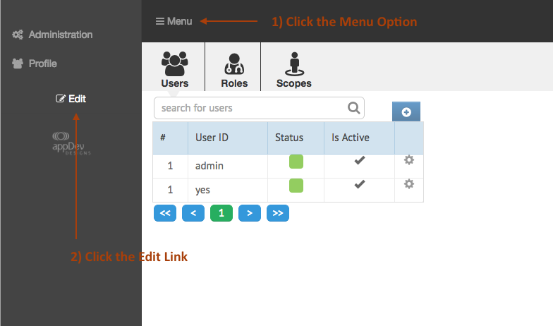
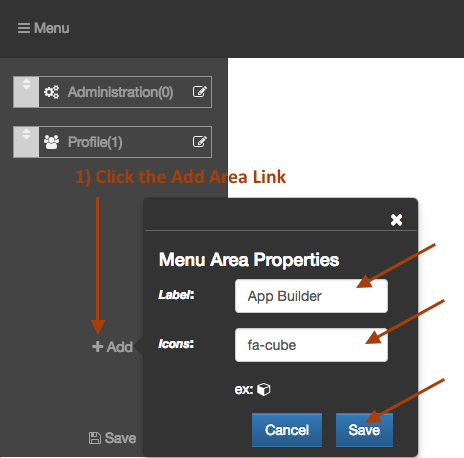
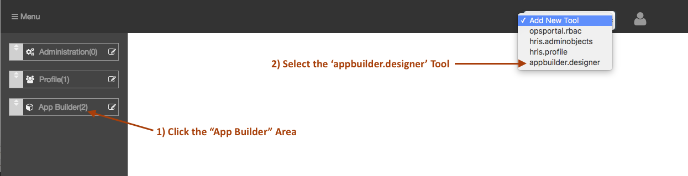
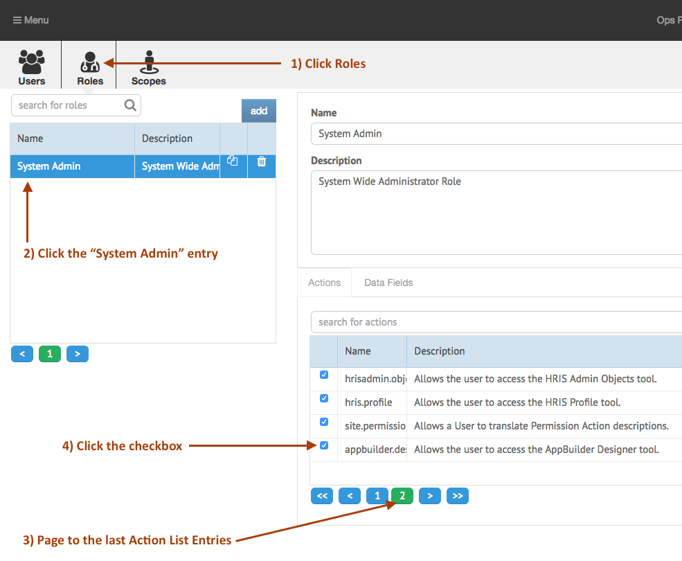
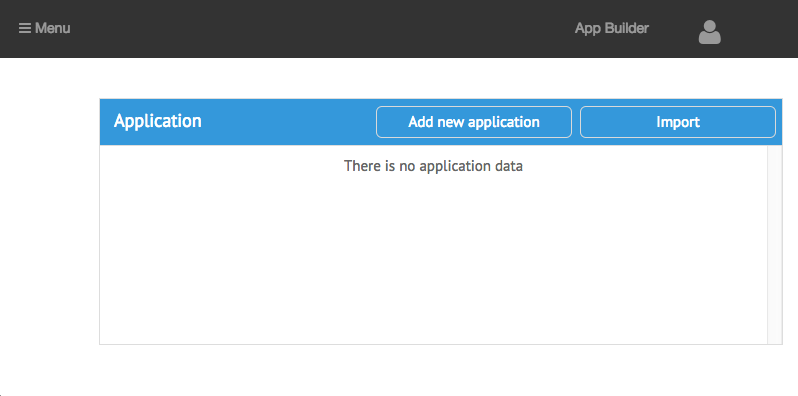

[< Tutorial: App Builder Data Type](tutorial.md)
# Tutorial - App Builder Setup and installation
Let's install the App Builder tool into your current Ops Portal Development Environment.

### Prerequsite
I'm expecting that you have already walked through our [Developer Setup](../../develop/develop_setup.md) process and have an existing sails directory and an OpsPortal installed.  If not, then go do that [now](../../develop/develop_setup.md).


### Installation

After running the Developer Setup, you should have a `your/development/directory/[sailsRoot]` directory created with your Ops Portal setup.

Now install the App Builder tool in your development environment:
```sh
$ cd your/development/directory[sailsRoot]
$ npm install --save appdevdesigns/app_builder
```

Once that finishes, edit your local configuration information and update the DB connection:
```sh
$ vi config/local.js
```

The App Builder defined a new connection:
```json
module.exports = {
    "environment": process.env.NODE_ENV || 'development',
    "connections": {
        "appdev_default": {
            "host": "localhost",
            "port": 8889,
            "user": "root",
            "password": "root",
            "database": "test_nav"
        },
        "appBuilder": {
            "adapter": null,
            "host": null,
            "user": null,
            "password": null,
            "database": "appbuilder"     <---- Look here
        }
    },

    // the rest removed
```

The App Builder defined a new DB to store the working DB tables in.  You can do either of 2 things:

+ 1) create an `appbuilder` database in mysql 
+ 2) change `appbuilder` to the name of a current database in mysql

>Note: because of frequent changes to the table structures in the development cycle of the App Builder, we recommend the first option.


Now run sails again:
```sh
$ sails lift
```

And refresh your Ops Portal page.  


### Navigation Configuration

Now we will need to Add the App Builder to the Ops Portal navigation:

+ click on the [menu] icon
+ then click the [+ edit] link


This opens up the Navigation Editor.

+ click the [add] Area link
+ name the new area `App Builder` and give it a cube icon (`fa-cube`)
+ click [save]


This creates a new `Menu Area` in the Ops Portal Navigation.  Now we will add the App Builder tool to this `Menu Area`.

+ click the `App Builder` area.  Now the upper toolbar displays a drop list.
+ select `appbuilder.designer` in the droplist, and the App Builder tool will show up in the toolbar.


Now Select the [save] link and you will be returned to the OpsPortal.


### Permissions
Since the App Builder tool was just installed, we need to give your current user permission to see the tool.

Open the `[menu]` -> `[Administration]` -> `[Permission]`  Tool.
(it's probably the default tool that is showing now)

The Permission tool allows you to edit users, assign roles, and add permissions to the roles.

First click the `admin` user in the default user list.  And notice that it is assigned the `System Admin` role.

Now lets edit the `System Admin` role to have permission to access the App Builder:

+ click `[Roles]`
+ click the `[System Admin]` entry in the list
+ page to the last Action List entries
+ click the checkbox in front of the `appbuilder.designer.view` permission



At this point, your Ops Portal navigation should be updated to now show you the new `App Builder` Menu Area you created.

click `[menu]` -> `[App Builder]`  and now the App Builder interface should show up in the Ops Portal.


---
[< Tutorial: App Builder Data Type](tutorial.md)
[Step 2 : Client Side Data Type >](tutorial_step2.md) 