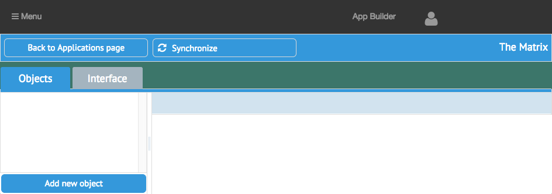
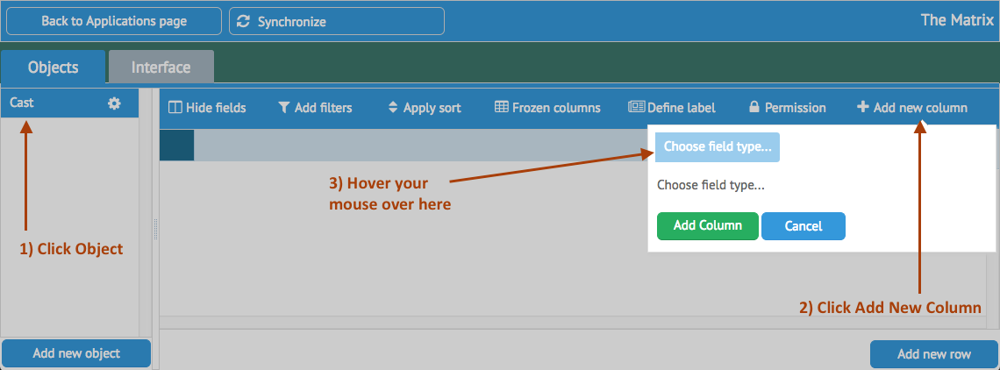
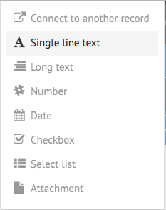
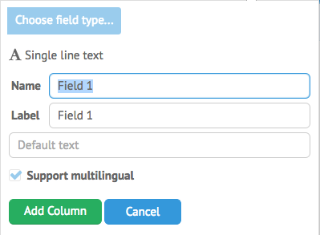
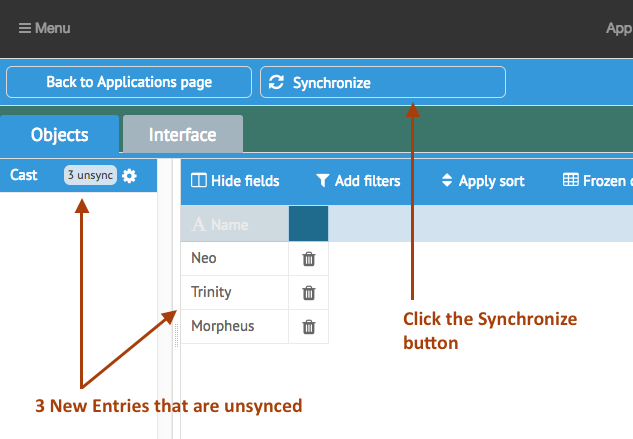
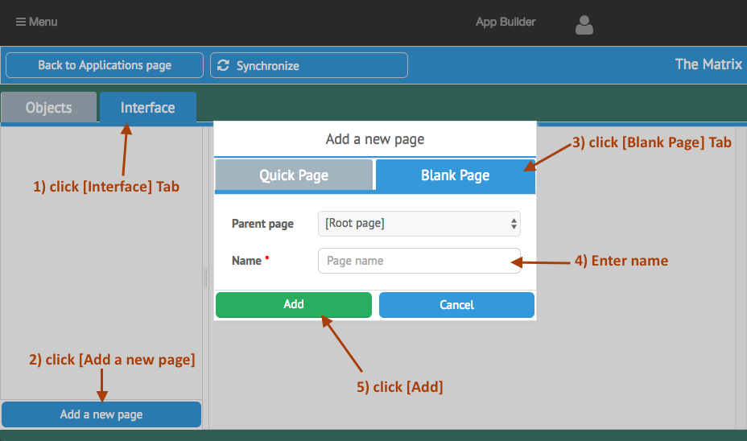
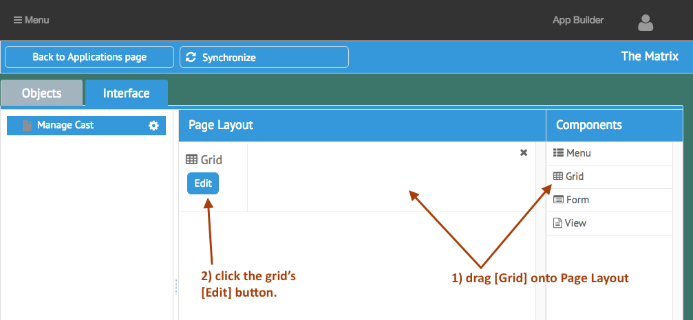
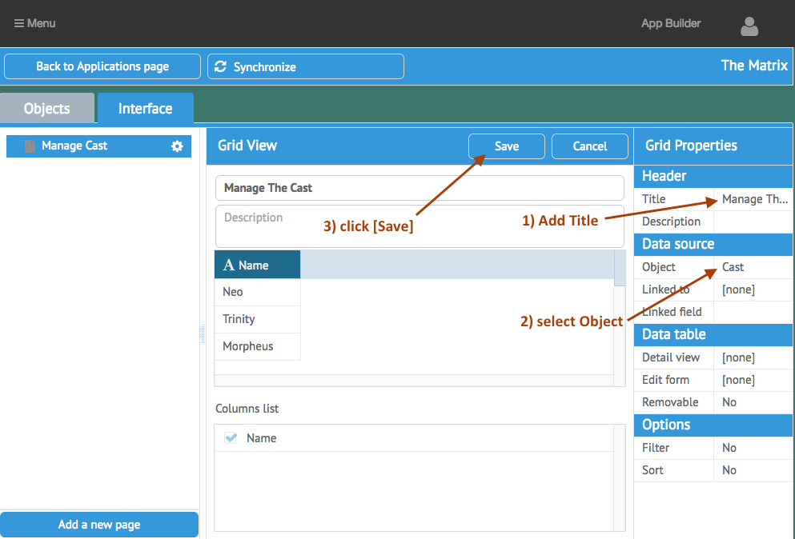
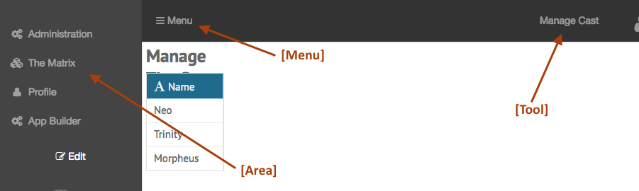

[< Tutorial: App Builder Setup and installation](tutorial_step1.md)
# Tutorial - Define a Test Application
Before we can develop a new Data Field, we'll need a working application to see our changes in.

### Create Application and Initial Test Object
First let's create a test application:

- click `[Add New Application]` 
- Fill out the form
  - name: The Matrix
  - description: What is the Matrix?
  - permission: choose the `System Admin` role
  - click `[save]`

Now select your new application in the list.

You should see the initial Application layout for `The Matrix`.

The App Builder currently allows you to build 2 things:  `Objects` and `Interfaces`
- **`Objects`** : define things you want to track ( Objects, Resources, Data Tables, etc... )
- **`Interfaces`** : define how you interact with these `Objects`

In this tutorial, we are building a new Data Field for an Object.  This Data Field will allow us to attach an image to our `Objects`.

##### Start with an Object

Let's create an Object and add an initial Data Field to see what our new Data Field is going to have to do.
- click on `[add new object]`
- and give it a name:  `Cast`

When the object is created, 
- click on the `Cast` entry in the list, and your workspace will now show the current definition and content of that Object.
- click the `[Add New Column]` button on the far right
- hover your mouse over the `Choose Field Type` button 

You will now be presented with a list of currently defined Data Fields in the App Builder.

Select the `Single Line Text` option, and you will be presented with an initial set of options for that Data Field:

- give the field a name: `Name`
- unselect the `support Multilingual` option 
- click `Add Column`

>Note: **`Name`** is what is used to store the value (think of it like a db table column name), and **`Label`** is what is displayed to the user on an `Interface`

Now you will see a new column labeled `Name` in the Object Workspace.  You can click the `[Add New Row]` on the bottom right to create an entry, and fill out a value in our first `Cast` object.  Go ahead and add several new rows.

Notice that for each new row you create, the `Cast` entry in the Object List shows you a count of unsynced values.  This interface is intended to be a quick edit/creation tool and allows you to add/remove columns and enter data on the fly.  However it doesn't persist any new columns and their values until you click on the `[Synchronize]` button.  _(synchronized columns will be updated live through this interface)_

Go ahead and click the `[Synchronize]` button now.  You will see a progress bar appear and show you the status of the synchronization.  

When that is finished, take a moment to see what happened on the server:
- there should be a new module in:  `[sailsRoot]/node_modules/ab_thematrix`  (let's call this `[appRoot]`)
  - name format: `[ab]`\_`[applicationNameNoSpaces]`
- there is a corresponding server side sails model defined:  `[appRoot]/api/models/AB_TheMatrix_Cast.js`
  - name format: `[AB]_[ApplicationNameNoSpaces]`\_`[ObjectNameNoSpaces]`.js
- there is also a client side Application defined: `[appRoot]/assets/opstools/AB_TheMatrix/`  (let's call this `[clientRoot]`)
  - name format: `[AB]`\_`[ApplicationNameNoSpaces]`
  - the client side application is organized in an MVC structure and is generated using [CanJS](https://canjs.com)
  - the client side model is found at: `[clientRoot]`/models/AB_TheMatrix_Cast.js
- back in step 1, you configured a DB table for the App Builder.  Open that DB now and take a look at the Tables the App Builder created.  The one for this object should be named `ab_thematrix_cast`.

##### Need an Interface to test as well
Now we want to test viewing our Data Field in a generated Interface.

- click the `[Interface]` Tab
- click `[Add a new Page]`
- in the popup, select the `[Blank Page]` tab
- Enter a name: Manage Cast
- click `[Add]`

Now you should see `Manage Cast` in your page list, and an empty Page Layout area.
- drag a `Grid` component from the far right column into the Page Layout
- then click the grid's `[Edit]` button.

now the Page Work area is replaced with the Component Editor.  The middle section shows an example of the Grid's output, and the far right is the Grid's property list.
- Add a Title: `Manage The Cast`
- Under `Data Source` click on the `Object` entry, and choose our newly created `Cast` object
- the Grid's output shows a sample output, with some options to select which columns we want to show.
- click the Grid's `[Save]` button

Now you are returned to the Page Layout view.  With your sample grid showing.

Click the `[Synchronize]` button to persist all these changes to the server.

When that is finished, take a look at:
- there should now be a new `[Menu]` -> `[The Matrix]` -> `[Manage Cast]` entry in the Ops Portal Navigation

- there is now a new Controller in `[clientRoot]`/controllers/ManageCast.js
  - name format: `[PageNameNoSpaces]`.js

If you select this Application from your Navigation Menu, you will see a basic Grid showing you the contents of our `Cast` data.

Now we are ready to create our Data Field .... 

---
[< Step 1 : App Builder Setup and installation](tutorial_step1.md)
[Step 3 : Client Side Data Type >](tutorial_step3.md) 