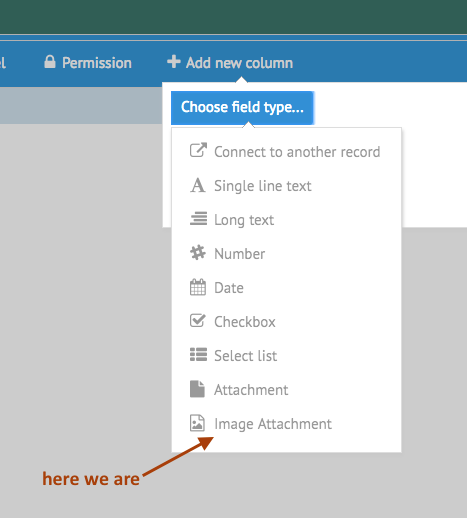

[< Tutorial: Define a Test Application](tutorial_step2.md)
# Tutorial - Client Side Data Type
Now we're ready to create our first data type.


### Prepare for making changes
Now let's get serious about making changes to the App Builder.

Make a new git branch for the Data Field we are creating:
```sh
$ cd [sailsRoot]/node_modules/app_builder
$ git checkout -b imageDataField
```
> NOTE: I'm going to refer to this directory as `[ABRoot]`


### Find the App Builder Data Fields
Let's look to where the client side objects for the App Builder is located:
`[ABRoot]/assets/opstools/BuildApp`  Lets call this `[ABRootUI]`

In `[ABRootUI]/controllers/` we have all the objects that manage the display of the application. There are some special sub-folders here:
- `data_fields` : defines the data fields available in the App Builder
- `page_components` : defines the components you can drag onto an Interface Page
- `utils` : yep ... some utilities
- `webix_custom_components` : not all our UI needs are met through the default [Webix](http://webix.com) library. Unique components are defined here.


For this tutorial, it is the `data_fields/` folder we are interested in.  Inside this folder, you should see an object defined for each of the Field Types shown in the pop up when creating a new column:


In addition, there are a few additional files:
- `dataFieldsManager.js` : This object manages the available dataFields and how they interact with the other objects in the App Builder
- `dataFieldTemplate.js` : This is a generic starter template for creating a data field.


### Create Initial DataType UI Object
Make a copy of the 'dataFieldTemplate.js' and rename it after the data type you want to create. In our example, we'll rename it `image.js`.
```sh
$ cd [ABRootUI]/controllers/data_fields
$ cp dataFieldTemplate.js image.js
```

Now open the `image.js` file in your editor of choice.

You'll notice there are some placeholders for the name of your object: `[DataFieldType]`

Do a global search for `[DataFieldType]` and replace with your new Data Field: `image`.

Now the file should be defining our new Data Field:  `imageDataField`


##### Initial Data Field definition
The initial definition of our `imageDataField` looks like this:
```javascript
  var imageDataField = {
    name: 'image',
    type: 'string',
    icon: 'font',    
    menuName: 'image',  
    includeHeader: true,
    description: ''
  };
```

- ** `name` ** : is a unique key for this Data Field.
- **`type`** : is a data type for how this data is stored.  Should match of of the [Sails types](http://sailsjs.org/documentation/concepts/models-and-orm/attributes#?attribute-options).
- **`icon`** : a [font-awesome](http://fontawesome.io/icons/) icon, but without the `fa-`. So if you want the `fa-image` icon, just put `image`.
- **`menuName`** : the text that shows up in the list of Data Fields to choose.
- **`includeHeader`** : Each Data Field needs a `name` and `label` value.  If you don't want to create those editors yourself, then set this to `true`. If you don't need them or want to do things your own way, set this to `false`.
- **`description`** : When filling out the preferences for a Data Field, this gives a brief explanation of what this Data Field is.


So, I'm going to fill out the definition like so:
```javascript
  var imageDataField = {
    name: 'image',  
    type: 'string', 
    icon: 'file-image-o',
    menuName: 'Image Attachment',  
    includeHeader: true,
    description: 'Attach an image to this object.'
  };
```


Now make sure the App Builder knows about your new Data Field:

- edit the `dataFieldsManager.js` file
- insert your new Data Field entry in the dependency list:
```javascript
// in dataFieldsManager.js
steal(
  'opstools/BuildApp/controllers/data_fields/connectObject.js',
  'opstools/BuildApp/controllers/data_fields/string.js',
  'opstools/BuildApp/controllers/data_fields/text.js',
  'opstools/BuildApp/controllers/data_fields/number.js',
  'opstools/BuildApp/controllers/data_fields/date.js',
  'opstools/BuildApp/controllers/data_fields/boolean.js',
  'opstools/BuildApp/controllers/data_fields/list.js',
  'opstools/BuildApp/controllers/data_fields/attachment.js',
  'opstools/BuildApp/controllers/data_fields/image.js',       // <--- I just added this
  function () {
    var self = {};
```


Save all your changes, then reload the Ops Portal, and lets see what happens.

Open our Application, click on the `Cast` object, and then click the `[Add New Column]` button. Hovering over the `[Choose Field Type]` button.


Select our new entry, and you will now see a **`Name`** and **`Label`** entry in our property list thanks to the `includeHeader:true` setting.


We're not really ready just yet for this new property, so click `[Cancel]`.

Now we need to make sure the Server Side of our App Builder is ready for this new Data Field ...

---
[< Step 2 : Define a Test Application](tutorial_step2.md)
[Step 4 : Server Side Data Type >](tutorial_step4.md) 