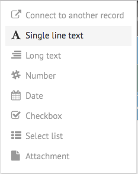
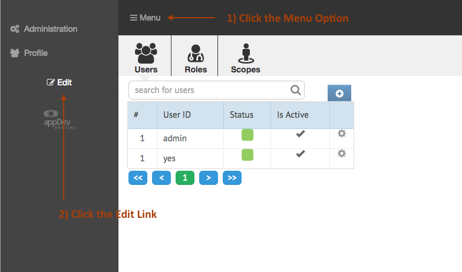

[< Tutorial: Define a Test Application](tutorial_step2.md)
# Tutorial - Client Side Data Type
Now we're ready to create our first data type.

### Find the App Builder Data Fields
Let's look to where the client side objects for the App Builder is located:
`[sailsRoot]/node_modules/app_builder/assets/opstools/BuildApp`  Lets call this `[ABRoot]`

In `[ABRoot]/controllers/` we have all the objects that manage the display of the application. There are some special sub-folders here:
- `data_fields` : defines the data fields available in the App Builder
- `page_components` : defines the components you can drag onto an Interface Page
- `utils` : yep ... some utilities
- `webix_custom_components` : not all our UI needs are met through the default [Webix](http://webix.com) library. Unique components are defined here.

For this tutorial, it is the `data_fields/` folder we are interested in.  Inside this folder, you should see an object defined for each of the Field Types shown in the pop up when creating a new column:

In addition, there are a few additional files:
- `dataFieldsManager.js` : This object manages the available dataFields and how they interact with the other objects in the App Builder
- `dataFieldTemplate.js` : This is a generic starter template for creating a data field.

### Create Initial DataType UI Object

### Fill Out UI methods

---
[< Step 2 : Define a Test Application](tutorial_step2.md)
[Step 4 : Server Side Data Type >](tutorial_step4.md) 