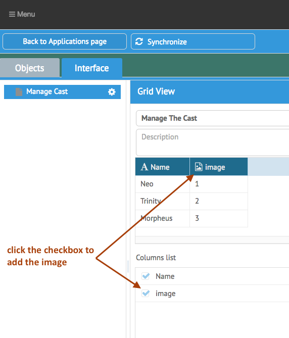

[< Tutorial: Client Side Data Type](tutorial_step3.md)
# Tutorial - Server Side Data Type
We need to tell the Server how to store this new Data Field.

The server will use a [SailsJS model](http://sailsjs.org/documentation/concepts/models-and-orm/models) to store the information for your object.  Each Data Field must define how the data it receives from the Client UI is to be stored as one of the [Sails Model Attribute Types](http://sailsjs.org/documentation/concepts/models-and-orm/attributes#?attribute-options).

It is important to keep in mind that the App Builder itself will call the `appdev` command line tool to generate the models.  That is the same tool you used to install your sails development environment.

Go ahead and run the help command on the `appdev resource` command.
```sh
$ appdev help resource
```

You should see the basic usage instructions for the command.  Notice the list of `[field]` entries at the end of the command.  This field definition is in the format: `fieldName`:`type`

- **`fieldName`** : is what you type in for `Name` in the Data Field Properties popup.
- **`type`** : is what you enterd in the `imageDataField.type` definition in last step.

However, things are not _always_ so simple, so the Server Side of the App Builder will give your Data Field a chance to customize what is sent to the `appdev resource` command.


### So let's do it already
Lets take a look at where the App Builder defines the Server Side Data Fields: `[ABRoot]/api/services/data_fields/`

In this directory, you will see a Data Field file for each Data Field defined in the Client UI.  

There is also a `dataFieldTemplate.js` file for you to copy and use in creating a new Data Field definition.  Go ahead and do that now:
```sh
$ cd [ABRoot]/api/services/data_fields/
$ cp dataFieldTemplate.js image.js
```
>NOTE: make sure the file name matches the `imageDataField.name` value you defined in the Client Data Field definition. _(minus the `.js` part)_

Open your new `image.js` file in your favorite editor:
```javascript
// [ABRoot]/api/services/data_fields/image.js

var AD = require('ad-utils');
module.exports = {
  getFieldString: function (column) {
    var dfd = AD.sal.Deferred();

    var colString = column.name + ':' + column.type;

    dfd.resolve(colString);
    return dfd;
  }
};
```

In the default case, we are simply returning **`fieldName`**:**`type`**

Also note that it is possible your Data Field might need to perform an asynchronous operation (a DB lookup for example), so this method needs to return a Deferred, and the Deferred is `.resolved()` with the final string.

Now when you add a Data Field to an Object, the instance of that Data Field is stored in the `ABColumn.js` model. You can see that model's definition at `[ABRoot]/api/models/ABColumn.js`. 
In some cases your Data Field will define some special properties, and if those properties effects what is generated here, you can access those values in `column.setting.[propertyName]`.

In our tutorial, our image attachment will store a reference to the image as a `string` that will be attached to a URL to access the image.  So the default `fieldName`:`type` format is fine.

Save this file and **restart sails**.
>NOTE: every time you add or update a new server side component, you will need to restart the running instance of sails so it will read in the changed file(s).
>OK, in case you haven't done this before, to restart sails, go to the terminal you ran it in last time, type `[control]-[c]`.  That should exit sails.  Then type `$ sails lift` again.

Now reload the Ops Portal in your browser.  Navigate back to your `Cast` object, and this time actually add our new Data Field as a column named 'Image'.

Then click the `[Synchronize]` button.  When the synchronization is complete, let's see what is generated for our server side Model: `[appRoot]/api/models/AB_TheMatrix_Cast.js`

The model should now have these attributes:
```javascript
attributes: {
  name  : { type: 'string' },
  image : { type: 'string' }
},
```

On the interface with the `Cast` object, type some values in the `Image` column.  Then check in your database to verify 

  1) there is a new column named `image`
  2) those values are being stored.


Now just for fun, in your browser, use the sails API to access the data: `http://localhost:1337/ab_thematrix/ab_thematrix_cast`

In a different browser (like switch from Chrome to Firefox, don't just open a new tab), enter the same url and see what happens.  Notice it makes you login.  That means the permissions are in place for the server API for this model and unauthorized users are unable to access it.

### Update the UI
Before we move on, let's update our Interface and have the default grid component show the new column.

- click the `Interface` tab
- click `Manage Cast` in the list
- click the `[edit]` button on the Grid


The `Image` column was added after this grid component was created.  So now we need to add the `Image` column to the display:
- click the `Image` checkbox
- click `[Save]`
- click `[Synchronize]`


When the synchronization is complete.  Reload the Ops Portal.  Then Navigate to the actual app that is generated.  The Grid should now show both column with your data in them.


This is a good time to go ahead and commit your current changes:
```sh
$ cd [ABRoot]
$ git add .
$ git commit -m 'initial image Data Field'
```


---
[< Step 3 : Client Side Data Type](tutorial_step3.md)
[Step 5 : How Images will be uploaded >](tutorial_step5.md) 