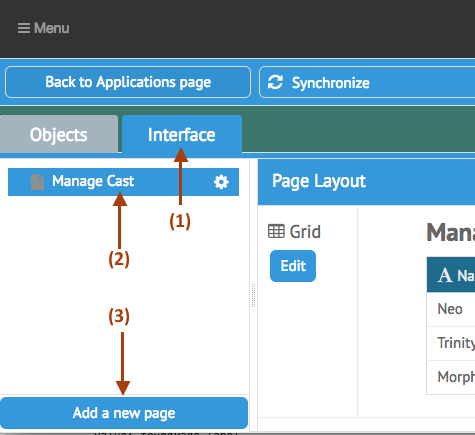
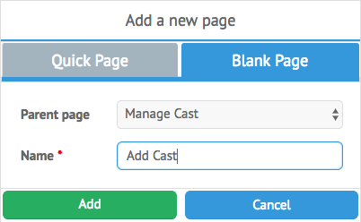
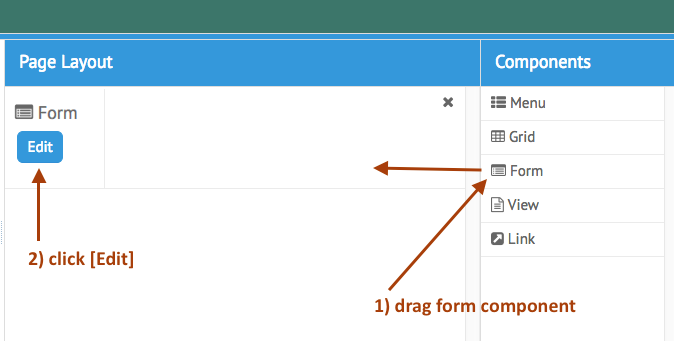
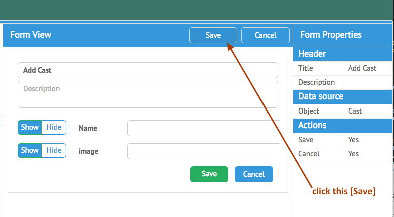
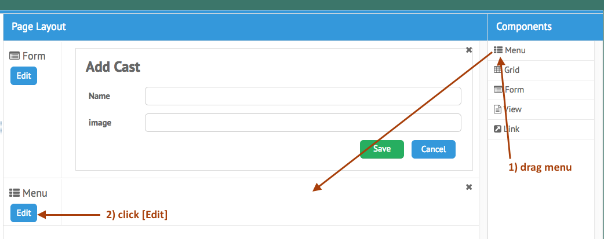
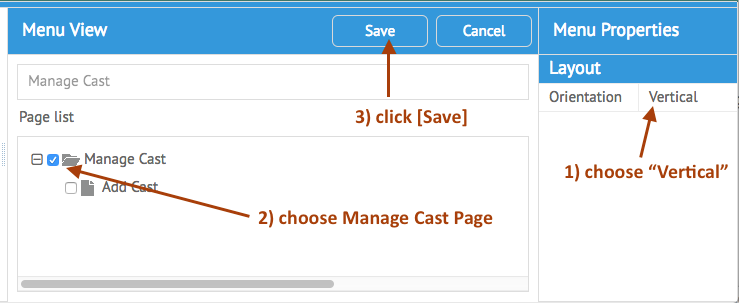

[< Tutorial: How Images will be uploaded](tutorial_step5.md)
# Tutorial - Add A Form to our Application
Currently our application only has a Grid component.  This Grid component is a read only display of the information.  

To test out our Data Field, we will also want to see it in action in a Form component.  So right now, let's add a form Component:

### Add a New Page
Open the Ops Portal, and return to our `The Matrix` Application.

- click `Interface`
- click `Manage Cast`
- click `[Add Page]`

In the popup dialogue:

- click `Blank Page` Tab
- parent : `Manage Cast` 
- name : `Add Cast`
- click: `[Add]`

> Note:  `Parent page` setting refers to how this page is stored.  A `[Root Page]` value, tells the App Builder to create a new Ops Portal Tool.  However, within an Ops Portal Tool, you can also have multiple pages for your application.  Simply select an existing Root Page, and we will create a sub page for that tool.

You should now see the new `Add Cast` page selected with a blank Page Layout area.

- drag a `Form` component onto the Page Layout area
- click the Form `[Edit]` button

Fill out the properties for the `Form`:

- `title` : "Add Cast"
- `Object` : choose our `Cast` object to be used with this `Form`
- `Save` : `Yes`
- `Cancel` : `Yes`
- click `[Save]`

> Note: once you choose an object as it's datasource, the form will auto display all the fields for this object.  You can remove a field by switching the toggle next to it in the form.

You should now be back at the Page Layout view of your `Add Cast` page.  

- drag a `menu` component onto the Page Layout
- click `[Edit]` for the menu

> Note: Menu components are ways for you to navigate between pages within a Tool.  

Notice that only the current Pages for this tool are options for the menu.

- choose `orientation` : `Vertical`
- click the `Manage Cast` checkbox 
- click `[Save]`

You should be on the Page Layout view for the `Add Cast` page. Now lets add a link from the main `Manage Cast` page to our new `Add Cast` page:

- click the `Manage Cast` page in the list
- drag a menu component onto the Page Layout
- drag the menu component above the Grid
- click the `[Edit]` for the Menu component
- select the `Add Cast` page for this menu
- and `[Save]`

After this, `[Synchronize]`.

When the synchronization process is complete, reload the Ops Portal, and switch to `The Matrix` tool in the Navigation menu.

Try out the new features by 

- switching to the `Add Cast` page
- enter a new cast member
- click `[Save]`
- return to the `Manage Cast` page (link at bottom) if it doesn't auto return.
- and verify the new cast member is in your grid

Now our project has a round trip feature for working with our new Data Field.  

It's time to actually make this an image ...

---
[< Step 5 : How Images will be uploaded](tutorial_step5.md)
[Step 7 : Display The image uploader widget >](tutorial_step7.md) 