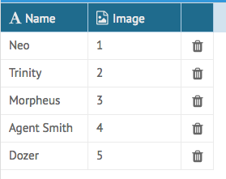
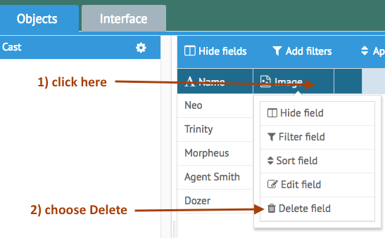
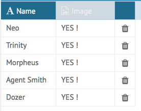
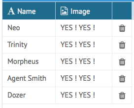
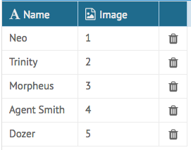
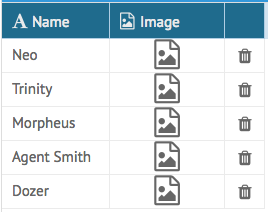
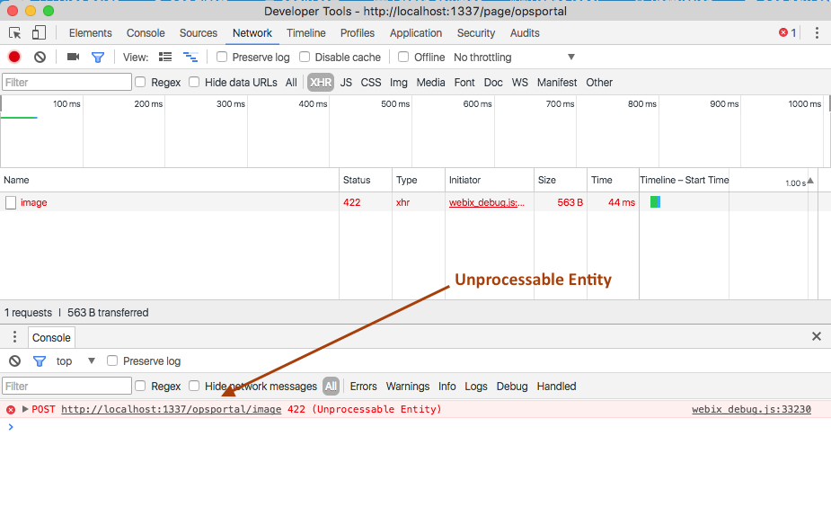
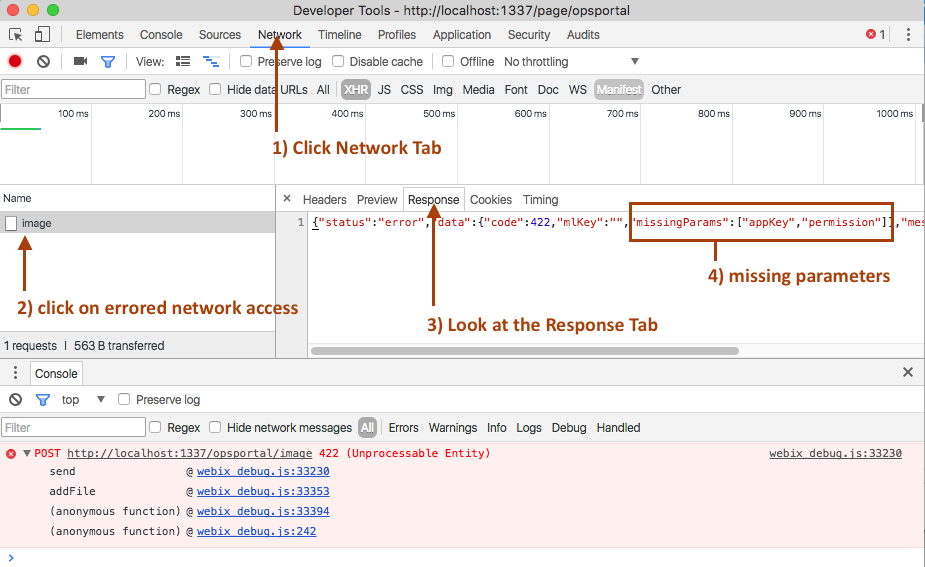
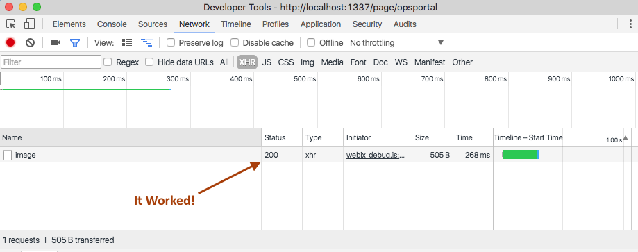

[< Tutorial: Add A Form to our Application](tutorial_step6.md)
# Tutorial - Display The image uploader widget
Up till now, our new Data Field is a glorified `String` component.  The field on the `Grid` and `Form` components are strings.  It stores strings in the DB.  It is a string.  Now it is time to make it an image.


### Webix Uploader
Webix offers some UI components for managing file uploading and displaying.  Spend some time reading through these pages:

- [General Uploading](http://docs.webix.com/desktop__file_upload.html)
- [Binding To Other Elements](http://docs.webix.com/desktop__apionly_uploader.html)
- [Invisible Drag N Drop Example](http://docs.webix.com/samples/21_upload/09_integration_to_element.html)


### Change our default display

Now go and open your client side `image.js` file in your favorite editor.
> Note: remember it is at `[ABRootUI]/controllers/data_fields/image.js`

First, let's tell the App Builder that we should not use a standard Webix Editor:
```javascript
imageDataField.getSettings = function () {
	return {
		fieldName: imageDataField.name,
		type: imageDataField.type,
		setting: {
			icon: imageDataField.icon,
			editor: 'imageDataField',		// <--- I just matched my DataField name
			filter_type: 'text', 
		}
	};
};
```

Now when one of our Components sees this, it will call our `.customDisplay()` method.  Also, let's insert a special `div` that we can put our unique display in:
```javascript
imageDataField.getSettings = function () {
	return {
		fieldName: imageDataField.name,
		type: imageDataField.type,
		setting: {
			icon: imageDataField.icon,
			editor: 'imageDataField',
			template:'<div class="ab-image-data-field"></div>',		// <--- use a template to insert our div
			filter_type: 'text', 
		}
	};
};
```

When the App Builder displays our Data Field, it will first insert our template into the webix cell, then call our `.customDisplay()` up update that display.  So let's uncomment the `.customDisplay()`:
```javascript
	imageDataField.customDisplay = function (application, object, fieldData, rowId, data, itemNode, options) {

		return true;
	};
```

Let's start by finding our embedded template, and inserting something to make sure it is working as expected:
```javascript
	imageDataField.customDisplay = function (application, object, fieldData, rowId, data, itemNode, options) {

		$(itemNode).find('.ab-image-data-field').append(' YES !');

		return true;
	}
```

Refresh the Ops Portal, and look at the values now for our Data Field.



**Not what you expected?  Yeah, me neither. It hasn't changed. **

It turns out, that because we created this column with the previous version of our imageDataField, it stored the previous values for `.editor` and it still works the way it did before, even though we updated the imageDataField.js object.  

- so delete the current `Image` column


- and re-add a new column based upon our new definition for our `imageDataFile`


Now that was what I was hoping for.

- be sure to `[Synchronize]` the change as well.


>Notice how we are doubling our values.  This means that `.customDisplay()` will be called numerous times on an existing cell.  Instead of `.appending` our display, we should clear and refresh, or check to see if it doesn't exist first.


### Display Icon for an empty value
If our current field doesn't have a value, display an image icon in it's place:

```javascript
	imageDataField.customDisplay = function (application, object, fieldData, rowId, data, itemNode, options) {
		// find the container from our this.getSettings().setting.template 
		var $container = $(itemNode).find('.ab-image-data-field');

		// clear contents
		$container.html('');

		var imgDiv = null; 

		// if data is empty, then display the file Icon
		if ( !data || data == '') {
			imgDiv = '<div class="image-data-field-icon" style="text-align: center;"><i class="fa fa-file-image-o fa-2x"></i></div>';
		} else {
			// else display the image:
			imgDiv = data;
		}

		// insert the image to display
		$container.html(imgDiv);

		return true;
	};
```

Now reload the Ops Portal, and navigate back to the `Cast` object interface.


Well, our values are back thanks to the `imgDiv = data;` line, but what I really wanted to see was the image icon.  Open your `DataBase -> appbuilder -> ab_thematrix_cast` table, and clear out the values in the `image` column.  Then click the `Interface` tab, and then click back on the `Objects` tab.  This will refresh the display:



### Configure a Webix Uploader
Now let's add a webix uploader to listen to changes on that image.
```javascript

		// insert the image to display
		$container.html(imgDiv);

		var uploader = webix.ui({ 
		    view:"uploader",  
		    apiOnly: true, 
		    upload:'/opsportal/image',
		    inputName:'image',
		    multiple: false
		});

		return true;
```

Actually, this is an [apiOnly](http://docs.webix.com/desktop__apionly_uploader.html#usingapiolyuploaderfordragndrop) uploader implementation, so we'll have to define a `.addDropZone()` that will trigger the upload.
```javascript

		// insert the image to display
		$container.html(imgDiv);

		var uploader = webix.ui({ 
		    view:"uploader",  
		    apiOnly: true, 
		    upload:'/opsportal/image',
		    inputName:'image',
		    multiple: false
		});
		uploader.addDropZone($container[0]);		// <--- like this one

		return true;
```
>Note: `.addDropZone()` attaches directly to DOM elements.  `$container` is technically a jQuery array of DOM elements, so return the first element.

OK, refresh the page and drag and drop an image over one of your file icons.  Doesn't look like anything happened, does it?  Well open your developer tools and check out your `Network` activity and `Console`.  You should see notifications of an error: `422 (Unprocessable Entity)`.



A closer look at the response from the service shows a descriptive error message informing us that we are missing some required parameters:



That's right, the service requires some additional parameters.  Let's add that to the uploader:
```javascript

		// insert the image to display
		$container.html(imgDiv);


		// The Server Side action key format for this Application:
		var actionKey = 'opstool.AB_'+application.name.replace('_','')+'.view';

		var uploader = webix.ui({ 
		    view:"uploader",  
		    apiOnly: true, 
		    upload:'/opsportal/image',
		    inputName:'image',
		    multiple: false,
		    formData:{							// <---- formData parameter
		    	appKey:application.name,
		    	permission:actionKey,
		    	isWebix:true
		    }
		});
		uploader.addDropZone($container[0]);

		return true;
```


Now, reload the Ops Portal and try dropping an image again.  What do you see?

>Note: for now, upload small image files, like <= 3K.  You'll see why later.


### Show some indicators
So it worked, but I couldn't see any changes to the interface to indicate anything was happening.  So let's add a Webix Spinner to the component to indicate the network operation is in progress:

- create a unique `keyField` for this instance of the data field and add it to the `$container`
```javascript

		var keyField = [ application.name, object.name, fieldData.name, rowId].join('-'); // <-- unique Field


		// find the container from our this.getSettings().setting.template 
		var $container = $(itemNode).find('.ab-image-data-field');

		// clear contents
		$container.html('');
		$container.attr('id', keyField);			                         // <--- add the keyField as the #id

		var imgDiv = null; 

		// if data is empty, then display the file Icon
		if ( !data || data == '') {
			imgDiv = '<div class="image-data-field-icon" style="text-align: center;"><i class="fa fa-file-image-o fa-2x"></i></div>';
		} else {
			// else display the image:
			imgDiv = data;
		}

		// insert the image to display
		$container.html(imgDiv);
```

- instead of just showing an icon **or** the raw data, put **both** there and choose one to show:
```javascript

		var keyField = [ application.name, object.name, fieldData.name, rowId].join('-');


		// find the container from our this.getSettings().setting.template 
		var $container = $(itemNode).find('.ab-image-data-field');

		// clear contents
		$container.html('');
		$container.attr('id', keyField);

		// the display of our image:
		// .image-data-field-icon : for an image icon when no data is present
		// .image-data-field-image: for an actual  of the data.
		var imgDiv = [
			'<div class="image-data-field-icon" style="text-align: center;display:none;"><i class="fa fa-file-image-o fa-2x"></i></div>',
			'<div class="image-data-field-image" style="display:none;"></div>'
		].join('\n');


		// insert the image to display
		$container.html(imgDiv);


		// if data is empty, then display the file Icon
		if ( !data || data == '') {
			$container.find('.image-data-field-icon').show();
		} else {
			// else display the image:
			$container.find('.image-data-field-image').show();
		}


		// The Server Side action key format for this Application:
		var actionKey = 'opstool.AB_'+application.name.replace('_','')+'.view';

```

- instead of adding `imgDiv` directly to `$container`, create a Webix Template that displays the data:
```javascript

		// the display of our image:
		// .image-data-field-icon : for an image icon when no data is present
		// .image-data-field-image: for an actual  of the data.
		var imgDiv = [
			'<div class="image-data-field-icon" style="text-align: center;display:none;"><i class="fa fa-file-image-o fa-2x"></i></div>',
			'<div class="image-data-field-image" style="display:none;"></div>'
		].join('\n');


		// use a webix component for displaying the content.
		// do this so I can use the progress spinner
		var webixContainer = webix.ui({
			view:'template',

			container:keyField,			// <--- must match the $container.id
			template:imgDiv,			// <--- here is our data to display

			borderless:true,
			height:33,
			autoHeight:true,
			autoWidth:true
		});


		// if data is empty, then display the file Icon
		if ( !data || data == '') {
			$container.find('.image-data-field-icon').show();
		} else {
			// else display the image:
			$container.find('.image-data-field-image').show();
		}

```

- extend the template so it has ProgressBar features:
```javascript

		// use a webix component for displaying the content.
		// do this so I can use the progress spinner
		var webixContainer = webix.ui({
			view:'template',

			container:keyField,			
			template:imgDiv,			

			borderless:true,
			height:33,
			autoHeight:true,
			autoWidth:true
		});
		webix.extend(webixContainer, webix.ProgressBar);   // <--- 


		// if data is empty, then display the file Icon
		if ( !data || data == '') {
			$container.find('.image-data-field-icon').show();
		} else {
			// else display the image:
			$container.find('.image-data-field-image').show();
		}

```

- and now detect when a file starts loading, and start the spinner:
```javascript

		// The Server Side action key format for this Application:
		var actionKey = 'opstool.AB_'+application.name.replace('_','')+'.view';


		var uploader = webix.ui({ 
		    view:"uploader",  
		    apiOnly: true, 
		    upload:'/opsportal/image',
		    inputName:'image',
		    multiple: false,
		    formData:{
		    	appKey:application.name,
		    	permission:actionKey,
		    	isWebix:true
		    },
		    on: {										
		    	// when a file is added to the uploader
		    	onBeforeFileAdd:function(item){
		    		
					webixContainer.showProgress({			// <--- Start the spinning

					   type:"icon",
					   delay:2000
					});
				}
			}
		});
		uploader.addDropZone($container[0]);

		return true;

```

- likewise, stop spinning when things are finished:
```javascript

		    formData:{
		    	appKey:application.name,
		    	permission:actionKey,
		    	isWebix:true
		    },
		    on: {

		    	// when a file is added to the uploader
		    	onBeforeFileAdd:function(item){
					webixContainer.showProgress({
					   type:"icon",
					   delay:2000
					});
				},

		    	// when upload is complete:
		    	onFileUpload:function(item, response){
					
					webixContainer.hideProgress();				// <--- Stop spinning on success
					
				},

				// if an error was returned
				onFileUploadError:function(item, response){
					
					webixContainer.hideProgress();				// <--- Stop spinning on failure
				}
		    }
		});
		uploader.addDropZone($container[0]);

		return true;

```

OK, now reload the Ops Portal, and drag an image over the file icon.  Did you see it?  Try it a few more times.


### Update the display with the loaded image
If our data is empty, we want to display the Image Icon.  But if we have data, we want to use it to display the image.  

to make switching between those a little easier, lets refactor the code a bit:
```javascript

			borderless:true,
			height:33,
			autoHeight:true,
			autoWidth:true
		});
		webix.extend(webixContainer, webix.ProgressBar);


		$container.showIcon = function () {
			// $($container.find('img')).prop('src', '');
			$container.find('.image-data-field-image').hide();
			$container.find('.image-data-field-icon').show();
		}
		$container.showImage = function (uuid) {
			$($container.find('img')).prop('src', '/opsportal/image/'+application.name+'/'+uuid);
			$container.find('.image-data-field-icon').hide();
			$container.find('.image-data-field-image').show();
		}

		// if data is empty, then display the file Icon
		if ( !data || data == '') {
			$container.showIcon();
		} else {
			// else display the image:
			$container.showImage(data);
		}


		// The Server Side action key format for this Application:
		var actionKey = 'opstool.AB_'+application.name.replace('_','')+'.view';

```


Now when our file is completed loading, lets `.showImage()`:
```javascript

		    	// when a file is added to the uploader
		    	onBeforeFileAdd:function(item){
					webixContainer.showProgress({
					   type:"icon",
					   delay:2000
					});
				},

		    	// when upload is complete:
		    	onFileUpload:function(item, response){
					
					webixContainer.hideProgress();
					$container.showImage(response.data.uuid);        // <---- here
					
				},

				// if an error was returned
				onFileUploadError:function(item, response){
					
					webixContainer.hideProgress();
				}

```

Now reload Ops Portal, and drag an image onto one of your file icons.  See the nifty new image?  Sweet, huh?
But we are not done yet:

- click on the `Interface` Tab
- then click back on the `Object` Tab

Notice the image dissapears.  We haven't stored it yet ... 


### Let's Save the Image reference to our Data.
The App Builder listens to your `imageDataField` for `updated` events.  In order to perform the update you need to include the following fields in your published data:

- `.objectId` 	: The `id` of the `ABObject` this field belongs to
- `.columnName` : The `.name` of this field when it is stored in the DB
- `.rowId` 		: The `id` of the `Object` this is related to
- `.data`		: The data to store

```javascript

onFileUpload:function(item, response){

	webixContainer.hideProgress();
	$container.showImage(response.data.uuid);

	var updatePacket = {
		objectId : object.id,
		columnName : fieldData.name,
		rowId : rowId,
		data : response.data.uuid
	};
	$(imageDataField).trigger('update', updatePacket);
},
```

Now test it out again and this time make sure the image stays persisted.  Also verify it in the DB table.


### Some Error Checking
Of course, we want to be an `Image` Data Field, so we should put in some error checking to make sure we only upload valid `Image` types:
```javascript

onBeforeFileAdd:function(item){

	// verify file type
	var acceptableTypes = ['jpg', 'jpeg', 'bmp', 'png', 'gif'];
    var type = item.type.toLowerCase();
    if (acceptableTypes.indexOf(type) == -1){
        webix.message("Only ["+acceptableTypes.join(", ")+"] images are supported");
        return false;
    }

	// start progress indicator
	webixContainer.showProgress({
	   type:"icon",
	   delay:2000
	});
},

```

Now, reload the Ops Portal and try to drag a `.pdf` onto your image icon.  See the error message?

Things are going so well, what could possibly go wrong?

---
[< Step 6 : Add A Form to our Application](tutorial_step6.md)
[Step 8 : Something Went Wrong >](tutorial_step8.md) 