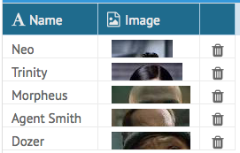
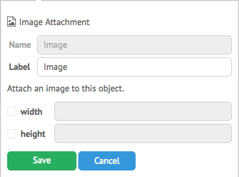
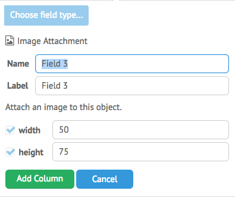

[< Tutorial: Something Went Wrong](tutorial_step8.md)
# Tutorial - Fix Width And Height

At this point, if you drag images onto your fields, the images are too big to fit into the grid cell the image is defined in.  



### Add Some New Settings
So, let's go and allow the user to specify a `width` and `height` parameter for this image when displaying in a grid or form.

- Add some additional webix form components in the `.editDefinition` settings:
```javascript
// [ABRootUI]/controllers/data_fields/image.js

	imageDataField.editDefinition = {
		id: componentIds.editView,
		rows:[
			{
				cols: [
					{
						view:"checkbox", 
						id:"useWidth", 
						labelRight:"width", 
			            width: 80,
			            labelWidth: 0,
						value:0,
			            click: function() {
							if (this.getValue())
								$$('imageWidth').enable()
							else
								$$('imageWidth').disable();
			            }
					},
					{
						view: 'text',
			          	id: 'imageWidth'
					}
				]
			},
			{
				cols: [
					{
						view:"checkbox", 
						id:"useHeight", 
						labelRight:"height", 
			          	width: 80,
			            labelWidth: 0,
						value:0,
			            click: function() {
							if (this.getValue())
								$$('imageHeight').enable()
							else
								$$('imageHeight').disable();
			            }

					},
					{
						view: 'text',
			          	id: 'imageHeight'
					}
				]
			}
		]
	}
```

- `useWidth` and `useHeight` checkboxes will indicate if we should pay attention to the respective `width` and `height` settings when displaying our image.
- `imageWidth` and `imageHeight` are the actual settings if the checkboxes are clicked

Reload your Ops Portal, choose your `Cast` object and then edit the `Image` column.


And now you can see our additional settings:



### Save those Settings
Now let's make sure those settings are saved and stored in our instance's setting values:
```javascript
	imageDataField.getSettings = function () {

		return {
			fieldName: imageDataField.name,
			type: imageDataField.type,
			setting: {
				icon: imageDataField.icon,

				editor: 'imageDataField',
				template:'<div class="ab-image-data-field"></div>',

				filter_type: 'text', 

				useWidth	: $$('useWidth').getValue(),			//<--- add values to our return obj
				imageWidth	: $$('imageWidth').getValue(),
				useHeight	: $$('useHeight').getValue(),
				imageHeight	: $$('imageHeight').getValue()
			}
		};
```

Reload your Ops Portal, and then edit your column again.  Now set some values:


Click `[Save]`.  

Looks good so far.  Now click `[Add new Column]` and select our `Image` Data Field again:


Notice how the form fields have not been reset for a new entry?


### Reset the Form Values
Let's now reset those values:
```javascript
imageDataField.resetState = function () {

	$$('useWidth').setValue(0);
	$$('imageWidth').setValue('');
	$$('useHeight').setValue(0);
	$$('imageHeight').setValue('');
	
};
```


Now run through those steps again:

- reload the Ops Portal
- edit the existing Column info: add width 50, height 75
- save 
- click `[Add New Column]`
- choose our `Image` data field
- see that the values are now cleared out.


Now, did you notice back on the second step above, that the editing of the existing column info did not have the default values added?  


### Populate From Settings
Lets tell our Data Field to default it's stored values on an edit operation.  

**But Wait:** I'm getting nervous with all the repeated strings I'm using for the Webix ids for our form components.  So first let's create those strings in our `componentIds` and reuse those in our definitions:
```javascript
var componentIds = {
	editView: 'ab-new-image',

	useWidth	: 'useWidth',
	imageWidth	: 'imageWidth', 
	useHeight	: 'useHeight',
	imageHeight	: 'imageHeight'
};
```
`<taking a deep breath>`_OK, I'm feeling better about this now._`</taking a deep breath>` Let's continue:

```javascript
imageDataField.populateSettings = function (application, data) {
	if (!data.setting) return;

	$$(componentIds.useWidth).setValue(data.setting.useWidth);
	$$(componentIds.imageWidth).setValue(data.setting.imageWidth);
	$$(componentIds.useHeight).setValue(data.setting.useHeight);
	$$(componentIds.imageHeight).setValue(data.setting.imageHeight);

};
```

Now, try this:

- Reload Ops Portal and view your `Cast` Object
- Edit our column information:

You should now see the previous settings implemented in the popup editor.


### Change the view of the Image


---
[< Step 8 : Something Went Wrong](tutorial_step8.md)
[Step 10 : Fix Width And Height >](tutorial_step10.md) 